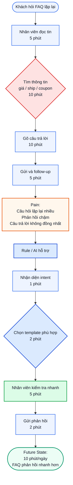

# 01 — Individual Problem Scan

## Case: Shop online nhận tin nhắn khách hàng từ nhiều kênh

Một shop online nhỏ thường bán hàng trên nhiều nền tảng khác nhau như Facebook, Zalo, TikTok Shop và Shopee. Mỗi ngày, shop nhận nhiều tin nhắn từ khách hàng về giá sản phẩm, tình trạng hàng, phí vận chuyển, thời gian giao hàng và yêu cầu đổi trả. Vì tin nhắn đến từ nhiều kênh khác nhau, chủ shop hoặc nhân viên dễ bỏ sót khách hàng, phản hồi chậm hoặc nhầm lẫn thông tin đơn hàng.


## Data note

Nguồn dữ liệu dự kiến dùng là Online Shopping Dataset trên Kaggle.

Dataset này được dùng làm dữ liệu tham chiếu để mô phỏng các thông tin shop thường cần tra cứu khi trả lời khách hàng, ví dụ: sản phẩm, giá, phí vận chuyển, coupon/discount và thông tin giao dịch. Dataset này không phải chat log thật, nên các chỉ số như thời gian phản hồi, số tin nhắn bị bỏ sót và tổng thời gian xử lý mỗi ngày là baseline ước lượng, cần validate thêm bằng khảo sát hoặc quan sát thực tế.

---

# Scan rộng

| #  | Lăng kính          | Problem quan sát được                                                                                  | Ai đang đau?               | Dấu hiệu thật                                            |
| -- | ------------------ | ------------------------------------------------------------------------------------------------------ | -------------------------- | -------------------------------------------------------- |
| 1  | Lặp lại            | Mỗi ngày shop phải kiểm tra tin nhắn từ Facebook, Zalo, TikTok Shop và Shopee                          | Chủ shop, nhân viên CSKH   | Phải mở nhiều app nhiều lần trong ngày                   |
| 2  | Lặp lại            | Khách hỏi đi hỏi lại các câu giống nhau như “giá bao nhiêu?”, “còn hàng không?”, “phí ship bao nhiêu?” | Nhân viên CSKH, khách hàng | Câu hỏi FAQ xuất hiện hằng ngày                          |
| 3  | Tốn thời gian      | Nhân viên phải tìm lại thông tin sản phẩm, giá, phí ship, mã giảm giá trước khi trả lời                | Nhân viên CSKH             | Mỗi câu trả lời cần đối chiếu nhiều nguồn dữ liệu        |
| 4  | Tốn thời gian      | Chủ shop phải tổng hợp cuối ngày xem còn khách nào chưa trả lời                                        | Chủ shop                   | Không có dashboard chung cho tất cả kênh                 |
| 5  | AI có thể tốt hơn  | Tin nhắn khách hàng chưa được tự động phân loại theo ý định như hỏi giá, hỏi đơn, hỏi đổi trả          | Nhân viên CSKH             | Tin mua hàng, tin FAQ và tin khiếu nại bị trộn lẫn       |
| 6  | AI có thể tốt hơn  | Shop không biết câu hỏi nào xuất hiện nhiều nhất để cải thiện mô tả sản phẩm                           | Chủ shop                   | Không có thống kê top câu hỏi của khách                  |
| 7  | Pain từ người khác | Khách phải chờ lâu vì shop phản hồi chậm                                                               | Khách hàng                 | Khách có thể chuyển sang shop khác nếu shop phản hồi trễ |
| 8  | Pain từ người khác | Khách nhận câu trả lời sai về giá, phí ship hoặc tình trạng đơn hàng                                   | Khách hàng, chủ shop       | Nhân viên dễ nhầm khi tra cứu thủ công                   |
| 9  | Tốn thời gian      | Yêu cầu đổi trả/khiếu nại phải kiểm tra lại mã đơn, lịch sử mua và chính sách đổi trả                  | Nhân viên CSKH, khách hàng | Một case khiếu nại có thể mất nhiều bước xử lý           |
| 10 | Lặp lại            | Nhân viên mới phải học lại cách trả lời khách theo từng loại câu hỏi                                   | Chủ shop, nhân viên mới    | Onboarding mất thời gian, câu trả lời dễ không đồng nhất |

## Vì sao phần scan này mạnh?

* Có scan rộng trước khi hội tụ.
* Có nhiều lăng kính khác nhau: lặp lại, tốn thời gian, AI có thể tốt hơn, pain từ người khác.
* Mỗi problem có actor và dấu hiệu thật.
* Không bắt đầu bằng “làm chatbot” hoặc “xây agent”.
* Các problem đều gắn với workflow bán hàng online hằng ngày.

---

# Top 3

| Rank | Problem                                                                                      | Vì sao chọn                                       | Điều còn chưa chắc                                       |
| ---- | -------------------------------------------------------------------------------------------- | ------------------------------------------------- | -------------------------------------------------------- |
| 1    | Tin nhắn khách hàng đến từ nhiều kênh, khiến shop dễ bỏ sót, phản hồi chậm và nhầm thông tin | Workflow rõ, xảy ra hằng ngày, có metric tốt      | Cần validate số tin nhắn/ngày và thời gian phản hồi thật |
| 2    | Câu hỏi khách hàng bị lặp lại về giá, tồn kho, phí ship, coupon                              | Có pain thật, có thể dùng rule/template/AI hỗ trợ | Cần biết bao nhiêu phần trăm tin nhắn là FAQ             |
| 3    | Đổi trả và khiếu nại khó theo dõi vì thông tin nằm rải rác nhiều kênh                        | Impact cao, ảnh hưởng trực tiếp đến uy tín shop   | Rủi ro cao hơn, cần người thật quyết định                |

---

# Problem Card #1 — Tin nhắn khách hàng nhiều kênh

**Problem 1 câu:**
Mỗi ngày shop online nhỏ phải kiểm tra tin nhắn khách hàng từ Facebook, Zalo, TikTok Shop và Shopee, trong đó bước đọc, phân loại và tìm thông tin trước khi trả lời tốn nhiều thời gian nhất, dễ làm shop bỏ sót khách hoặc phản hồi sai.

**Actor:**
Chủ shop hoặc nhân viên chăm sóc khách hàng chịu trách nhiệm trả lời khách trên nhiều nền tảng bán hàng.

**Thời điểm / bối cảnh:**
Diễn ra hằng ngày, đặc biệt vào giờ cao điểm bán hàng, khi chạy quảng cáo, livestream hoặc có chương trình khuyến mãi.

**Current workflow:**

```text
1. Kiểm tra Facebook
2. Kiểm tra Zalo
3. Kiểm tra TikTok Shop
4. Kiểm tra Shopee
5. Đọc từng tin nhắn và phân loại: hỏi giá, hỏi tồn kho, hỏi phí ship, hỏi đơn hàng, đổi trả/khiếu nại
6. Tìm thông tin sản phẩm hoặc đơn hàng
7. Trả lời khách thủ công
```

**Bottleneck:**
Bước 5 và 6 — đọc, phân loại tin nhắn và tìm thông tin sản phẩm/đơn hàng. Đây là bottleneck vì nhân viên phải chuyển qua lại nhiều nền tảng, đọc từng tin nhắn, tự hiểu khách đang hỏi gì, rồi tự đối chiếu thông tin sản phẩm, giá, phí ship, coupon hoặc đơn hàng trước khi trả lời.

**Impact:**
Shop mất nhiều thời gian mỗi ngày chỉ để kiểm tra và phản hồi tin nhắn. Khách có nhu cầu mua có thể phải chờ lâu hoặc bị bỏ sót. Nhân viên cũng có thể trả lời nhầm giá, phí vận chuyển, tình trạng hàng hoặc thông tin đơn hàng. Điều này làm giảm trải nghiệm khách hàng và có thể khiến khách chuyển sang shop khác.

**Success metric:**
Giảm tổng thời gian xử lý tin nhắn từ khoảng 75 phút/ngày xuống dưới 30 phút/ngày, không tăng số câu trả lời sai hoặc cần sửa lại.

| Metric                        |             Trước |                Sau kỳ vọng |
| ----------------------------- | ----------------: | -------------------------: |
| Tổng thời gian xử lý tin nhắn |      75 phút/ngày |            25–30 phút/ngày |
| Số nền tảng phải mở thủ công  |        4 nền tảng |              1 inbox chung |
| Thời gian phản hồi FAQ        |        10–30 phút |                Dưới 5 phút |
| Tin nhắn bị bỏ sót cuối ngày  | Chưa kiểm soát rõ |            Dưới 5 tin/ngày |
| Số câu trả lời sai/cần sửa    | Chưa kiểm soát rõ | Không tăng so với hiện tại |

**Non-AI alternative:**
Template trả lời nhanh, auto-reply theo keyword, phân công nhân viên trực từng kênh, checklist cuối ngày hoặc Google Sheet để ghi lại khách cần follow-up. Các cách này có thể giảm một phần công việc, nhưng chưa giải quyết tốt việc phân loại tin nhắn tự nhiên từ nhiều nền tảng và gợi ý trả lời theo dữ liệu shop.

**AI hypothesis:**
AI hỗ trợ phân loại ý định khách hàng và draft câu trả lời dựa trên dữ liệu sản phẩm/đơn hàng. Nhân viên vẫn review, chỉnh sửa và bấm gửi trước khi phản hồi khách.

**Quick gut:**
Workflow.

## Draft current workflow

```text
CURRENT STATE — khoảng 75 phút/ngày

[1 Kiểm tra Facebook: 15']
→ [2 Kiểm tra Zalo: 15']
→ [3 Kiểm tra TikTok Shop: 15']
→ [4 Kiểm tra Shopee: 15']
→ [5 Đọc + phân loại tin nhắn: 10']  <-- bottleneck
→ [6 Tìm thông tin sản phẩm/đơn hàng: 10']  <-- bottleneck
→ [7 Trả lời khách thủ công: 5']
```

## Draft future workflow

```text
FUTURE STATE — khoảng 25–30 phút/ngày

[1 Gom tin nhắn về inbox chung: 2']
→ [2 AI gắn nhãn ý định khách hàng: 3']
→ [3 AI gợi ý câu trả lời: 5']
→ [4 Nhân viên review + chỉnh sửa: 15']  <-- human boundary
→ [5 Gửi phản hồi + nhắc tin chưa xử lý: 3']

Fallback: AI gợi ý sai → nhân viên tự trả lời thủ công.
```

## Mermaid workflow

```mermaid
flowchart TD
    A([Shop nhận tin nhắn từ nhiều kênh])

    A --> B[Kiểm tra Facebook<br/>15 phút]
    B --> C[Kiểm tra Zalo<br/>15 phút]
    C --> D[Kiểm tra TikTok Shop<br/>15 phút]
    D --> E[Kiểm tra Shopee<br/>15 phút]
    E --> F{Đọc + phân loại<br/>tin nhắn<br/>10 phút}
    F --> G{Tìm thông tin<br/>sản phẩm / đơn hàng<br/>10 phút}
    G --> H[Trả lời khách thủ công<br/>5 phút]

    H --> I[Pain:<br/>Dễ bỏ sót khách<br/>Phản hồi chậm<br/>Nhầm thông tin đơn hàng]

    I --> J[AI Workflow cải thiện]

    J --> K[Gom tin nhắn về<br/>1 inbox chung<br/>2 phút]
    K --> L{AI gắn nhãn<br/>ý định khách hàng<br/>3 phút}
    L --> M{AI gợi ý<br/>câu trả lời<br/>5 phút}
    M --> N[Nhân viên review<br/>và chỉnh sửa<br/>15 phút]
    N --> O[Gửi phản hồi<br/>+ nhắc tin chưa xử lý<br/>3 phút]
    O --> P([Future State:<br/>25-30 phút/ngày<br/>Ít bỏ sót hơn])

    classDef normal fill:#EEF4FF,stroke:#2563EB,stroke-width:1.5px,color:#111827;
    classDef bottleneck fill:#FEE2E2,stroke:#DC2626,stroke-width:2px,color:#111827;
    classDef ai fill:#DBEAFE,stroke:#1D4ED8,stroke-width:2px,color:#111827;
    classDef human fill:#DCFCE7,stroke:#16A34A,stroke-width:2px,color:#111827;
    classDef pain fill:#FFF7ED,stroke:#EA580C,stroke-width:2px,color:#111827;
    classDef result fill:#ECFDF5,stroke:#059669,stroke-width:2px,color:#111827;

    class A,B,C,D,E,H,K,O normal;
    class F,G bottleneck;
    class J,L,M ai;
    class N human;
    class I pain;
    class P result;
```



---

# Problem Cards #2 và #3 — tóm tắt

| Card                              | Actor                                | Bottleneck                                           | Metric                           | Quick gut       | Vì sao chưa chọn làm #1                                     |
| --------------------------------- | ------------------------------------ | ---------------------------------------------------- | -------------------------------- | --------------- | ----------------------------------------------------------- |
| Câu hỏi khách hàng bị lặp lại     | Nhân viên CSKH                       | Tìm thông tin giá/ship/coupon rồi gõ lại câu trả lời | 30 phút/ngày → dưới 10 phút/ngày | Rule / Workflow | Có thể chỉ cần template hoặc rule, scope hẹp hơn            |
| Đổi trả và khiếu nại khó theo dõi | Chủ shop, nhân viên CSKH, khách hàng | Tìm mã đơn, lịch sử mua và theo dõi trạng thái xử lý | 35 phút/case → dưới 15 phút/case | Workflow        | Rủi ro cao hơn, cần người thật quyết định hoàn tiền/đổi trả |

## Draft workflow — Problem Card #2

```text
CURRENT STATE — khoảng 30 phút/ngày

[1 Khách hỏi FAQ]
→ [2 Nhân viên đọc tin: 5']
→ [3 Tìm thông tin giá/ship/coupon: 10']  <-- bottleneck
→ [4 Gõ câu trả lời: 10']
→ [5 Gửi và follow-up: 5']

FUTURE STATE — khoảng 10 phút/ngày

[1 Khách hỏi FAQ]
→ [2 Rule/AI nhận diện intent: 1']
→ [3 Chọn template phù hợp: 2']
→ [4 Nhân viên kiểm tra nhanh: 5']  <-- human boundary
→ [5 Gửi phản hồi: 2']

Fallback: Không đủ dữ liệu hoặc không phải FAQ → chuyển người thật xử lý.
```

## Mermaid workflow — Problem Card #2



## Draft workflow — Problem Card #3

```text
CURRENT STATE — khoảng 35 phút/case

[1 Khách nhắn khiếu nại: 2']
→ [2 Nhân viên đọc + hỏi thêm thông tin: 5']
→ [3 Tìm mã đơn/lịch sử mua: 15']  <-- bottleneck
→ [4 Kiểm tra chính sách đổi trả: 5']
→ [5 Chọn hướng xử lý: 5']
→ [6 Theo dõi thủ công: 3']

FUTURE STATE — khoảng 15 phút/case

[1 Tin khiếu nại vào inbox chung: 1']
→ [2 AI nhận diện case đổi trả/khiếu nại: 1']
→ [3 AI tóm tắt vấn đề + trích mã đơn: 2']
→ [4 Nhân viên kiểm tra thông tin đơn hàng: 5']  <-- human boundary
→ [5 Nhân viên chọn hướng xử lý: 5']  <-- human boundary
→ [6 Hệ thống gắn trạng thái follow-up: 1']

Fallback: AI không đủ dữ liệu → nhân viên xử lý thủ công.
```

## Mermaid workflow — Problem Card #3

```mermaid
flowchart TD
    A([Khách gửi yêu cầu<br/>đổi trả / khiếu nại])
    A --> B[Nhân viên đọc tin<br/>2 phút]
    B --> C[Hỏi thêm thông tin<br/>5 phút]
    C --> D{Tìm mã đơn<br/>và lịch sử mua<br/>15 phút}
    D --> E[Kiểm tra chính sách đổi trả<br/>5 phút]
    E --> F[Chọn hướng xử lý<br/>5 phút]
    F --> G[Theo dõi thủ công<br/>3 phút]
    G --> H[Pain:<br/>Xử lý chậm<br/>Dễ quên follow-up<br/>Ảnh hưởng uy tín shop]

    H --> I[AI Workflow hỗ trợ]
    I --> J[Tin khiếu nại vào<br/>inbox chung<br/>1 phút]
    J --> K{AI nhận diện case<br/>đổi trả / khiếu nại<br/>1 phút}
    K --> L{AI tóm tắt vấn đề<br/>+ trích mã đơn<br/>2 phút}
    L --> M[Nhân viên kiểm tra<br/>thông tin đơn hàng<br/>5 phút]
    M --> N[Nhân viên chọn<br/>hướng xử lý<br/>5 phút]
    N --> O[Hệ thống gắn<br/>trạng thái follow-up<br/>1 phút]
    O --> P([Future State:<br/>15 phút/case<br/>Case rõ trạng thái hơn])

    classDef normal fill:#EEF4FF,stroke:#2563EB,stroke-width:1.5px,color:#111827;
    classDef bottleneck fill:#FEE2E2,stroke:#DC2626,stroke-width:2px,color:#111827;
    classDef ai fill:#DBEAFE,stroke:#1D4ED8,stroke-width:2px,color:#111827;
    classDef human fill:#DCFCE7,stroke:#16A34A,stroke-width:2px,color:#111827;
    classDef pain fill:#FFF7ED,stroke:#EA580C,stroke-width:2px,color:#111827;
    classDef result fill:#ECFDF5,stroke:#059669,stroke-width:2px,color:#111827;

    class A,B,C,E,F,G,J,O normal;
    class D bottleneck;
    class I,K,L ai;
    class M,N human;
    class H pain;
    class P result;
```



---

# Card muốn pitch

## Card muốn pitch

Problem Card #1 — Tin nhắn khách hàng nhiều kênh.

## Vì sao chọn card này

Tôi chọn card này vì đây là bài toán có workflow rõ nhất, xảy ra hằng ngày và có thể đo được bằng metric cụ thể. Pain chính không chỉ là khách nhắn nhiều, mà là tin nhắn đến từ nhiều nền tảng khác nhau, khiến shop phải kiểm tra thủ công, dễ bỏ sót khách, phản hồi chậm và nhầm thông tin đơn hàng.

Bài toán này cũng phù hợp để so sánh Rule / Workflow / Agent:

* Rule có thể hỗ trợ FAQ đơn giản.
* Workflow phù hợp nhất vì cần gom tin, phân loại, gợi ý trả lời và người thật review.
* Agent chưa phù hợp vì rủi ro nếu AI tự trả lời sai, tự hứa đổi trả hoặc xử lý nhầm đơn hàng.

## Pitch 60 giây

Một shop online nhỏ bán hàng trên Facebook, Zalo, TikTok Shop và Shopee. Mỗi ngày shop nhận nhiều tin nhắn về giá, tình trạng hàng, phí ship, thời gian giao hàng và đổi trả. Hiện tại, chủ shop hoặc nhân viên phải mở từng nền tảng, đọc từng tin, tự phân loại rồi tìm thông tin trước khi trả lời khách. Bottleneck nằm ở bước đọc, phân loại và tìm thông tin sản phẩm/đơn hàng. Việc này khiến shop mất khoảng 75 phút/ngày, dễ bỏ sót khách và phản hồi chậm. Tôi đề xuất không làm Agent tự trả lời toàn bộ, mà chọn Workflow: gom tin nhắn về một inbox chung, AI phân loại ý định và gợi ý câu trả lời, sau đó nhân viên review trước khi gửi.

## Câu hỏi muốn nhóm challenge

1. Với shop nhỏ, bài toán này có thật sự cần AI không hay chỉ cần inbox chung và template?
2. Những loại tin nhắn nào AI được phép gợi ý trả lời?
3. Case nào bắt buộc chuyển người thật xử lý?
4. Baseline 75 phút/ngày có hợp lý không, cần đo lại bằng cách nào?
5. Nếu chỉ pilot 1–2 kênh trước, nên chọn Facebook/Zalo hay Shopee/TikTok Shop?
6. Success metric nào quan trọng hơn: giảm thời gian xử lý, giảm tin bỏ sót hay giảm phản hồi sai?
