# 02 — Group Problem Statement


> **Case nhóm chọn:** Tư vấn và phản hồi inbox đa kênh cho shop online nhỏ


Một shop online nhỏ bán hàng trên nhiều kênh như Facebook, Zalo, TikTok Shop và Shopee. Mỗi ngày shop nhận nhiều tin nhắn khách hàng về giá sản phẩm, tình trạng hàng, size, phí vận chuyển, thời gian giao hàng, trạng thái đơn và yêu cầu đổi trả. Vì tin nhắn nằm rải rác ở nhiều nền tảng, chủ shop hoặc nhân viên CSKH phải kiểm tra thủ công từng app, đọc từng tin, phân loại ý định khách hỏi, tra thông tin sản phẩm hoặc đơn hàng rồi mới trả lời.


**Pain chính** không chỉ là "khách nhắn nhiều", mà là việc shop phải xử lý inbox đa kênh trong khi nhân sự ít. Điều này khiến shop dễ bỏ sót khách, phản hồi chậm, trả lời không đồng nhất hoặc nhầm thông tin sản phẩm, size, giá, tồn kho và trạng thái đơn hàng.


---


## 1. Group convergence


Nhóm có 3 người. Mỗi người share 3 problem candidates từ phần cá nhân, tổng cộng 9 candidates. Sau đó nhóm gom các candidate có pattern giống nhau thành các cluster.


### 1.1 Danh sách 9 candidates ban đầu


| # | Người đưa ra | Candidate problem | Người gặp vấn đề | Điểm nghẽn |
|---|---|---|---|---|
| 1 | Chung | Tin nhắn khách hàng nhiều kênh | Chủ shop / nhân viên CSKH | Phải kiểm tra Facebook, Zalo, TikTok Shop, Shopee thủ công |
| 2 | Chung | Câu hỏi khách hàng bị lặp lại | Nhân viên CSKH | Phải trả lời lại các câu hỏi về giá, tồn kho, phí ship, coupon |
| 3 | Chung | Đổi trả và khiếu nại khó theo dõi | Chủ shop / CSKH / khách hàng | Phải tìm mã đơn, lịch sử mua và trạng thái xử lý |
| 4 | Kỳ | Tư vấn và chốt đơn inbox đa kênh | Chủ shop thời trang online | Trả lời lặp, tư vấn size, phản hồi chậm làm mất đơn |
| 5 | Kỳ | Gom và bàn giao đơn đa kênh | Chủ shop / người đóng gói | Đơn chốt qua chat phải ghi tay, dễ sót hoặc nhầm size/mẫu |
| 6 | Kỳ | Tổng hợp review xấu để cải thiện sản phẩm | Chủ shop | Review rải rác nhiều sàn, khó biết sản phẩm nào hay lỗi |
| 7 | Danh | Khách hỏi giá nhiều kiểu | Nhân viên CSKH | Phải hiểu khách hỏi sản phẩm nào rồi tra giá và gõ lại |
| 8 | Danh | Tìm lại lịch sử chat của khách | Nhân viên CSKH | Phải cuộn/tìm thủ công lịch sử mua hoặc câu hỏi cũ |
| 9 | Danh | Soạn email khiếu nại hàng lỗi/giao sai | Nhân viên CSKH | Phải sửa template theo từng case, dễ mất thời gian |


### 1.2 Gom trùng / cluster


| Cluster | Candidates included | Pattern chung | Ghi chú |
|---|---|---|---|
| Inbox / CSKH đa kênh | #1, #4, #7 | Khách hỏi nhiều qua nhiều kênh; shop phải đọc, hiểu ý, tra thông tin và trả lời thủ công | Đây là cluster mạnh nhất vì xuất hiện trong cả 3 bài cá nhân |
| FAQ / tư vấn lặp lại | #2, #4, #7 | Nhiều câu hỏi lặp lại như giá, tồn kho, phí ship, size nhưng khách hỏi bằng nhiều cách khác nhau | Có thể dùng Rule cho case đơn giản và AI cho câu hỏi tự nhiên |
| Gom đơn / handoff đóng gói | #5 | Đơn chốt qua chat cần chuyển sang file xử lý, dễ sót hoặc nhầm | Pain rõ nhưng nghiêng về tool/POS hơn AI |
| Khiếu nại / đổi trả | #3, #9 | Cần tìm đơn hàng, kiểm tra chính sách và phản hồi khéo | Impact cao nhưng rủi ro cao, cần người thật quyết định |
| Review / insight sản phẩm | #6 | Review xấu nằm rải rác, cần tổng hợp để cải thiện sản phẩm | AI hợp nhưng outcome dài hạn, khó đo trong lab |
| Lịch sử khách hàng | #8 | Cần tìm lại thông tin khách cũ nhưng phải thao tác thủ công | Phụ thuộc API/history, scope kỹ thuật rộng |


### 1.3 Nhận xét sau khi gom cluster


Ba bài cá nhân đều hội tụ vào một pattern chung: **CSKH online bị quá tải vì thông tin khách hàng và tin nhắn nằm rải rác ở nhiều kênh.**


- **Bài của Chung** nhấn mạnh vấn đề đa kênh: Facebook, Zalo, TikTok Shop, Shopee.
- **Bài của Kỳ** có số liệu mạnh hơn về shop thời trang: 100-150 tin/ngày, nhiều câu hỏi lặp, mất đơn vì phản hồi chậm.
- **Bài của Danh** bổ sung góc CSKH: hỏi giá nhiều kiểu, tìm lịch sử chat lâu, email khiếu nại và áp lực từ phản hồi chậm.


Vì vậy, nhóm không chọn một bài quá hẹp như "hỏi giá bao nhiêu" hay "gom đơn cuối ngày", mà chọn candidate rộng vừa đủ: **Tư vấn và phản hồi inbox đa kênh cho shop online nhỏ.**


---


## 2. Shortlist và score


### 2.1 Shortlist


| Candidate | Vì sao vào shortlist | Rủi ro / điều chưa rõ |
|---|---|---|
| Tư vấn và phản hồi inbox đa kênh | Workflow rõ, xuất hiện trong cả 3 bài cá nhân, có số liệu thời gian và tần suất | Cần gom baseline từ nhiều nguồn thành một baseline thống nhất |
| Gom và bàn giao đơn đa kênh | Handoff rõ, impact vận hành rõ | Có thể dùng POS/tool sẵn, phần AI không nhiều |
| Tìm lại lịch sử chat của khách | Tốn thời gian, liên quan đa kênh | Phụ thuộc API và quyền truy cập lịch sử chat |
| Tổng hợp review xấu để cải thiện sản phẩm | AI phù hợp để đọc hiểu và phân loại review | Impact dài hạn, khó đo trong 4 tiếng lab |
| Soạn email khiếu nại | Workflow rõ, có thể dùng AI để draft | Tần suất thấp hơn inbox hằng ngày |


### 2.2 Score để đồng thuận


Chấm 1-5. Điểm không phải tuyệt đối, mục tiêu là ép nhóm nói rõ lý do chọn.


| Candidate | Actor rõ | Workflow rõ | Pain có evidence | Impact đo được | Làm trong lab | So sánh R/W/A được | Nhóm hiểu domain | **Tổng** |
|---|:--:|:--:|:--:|:--:|:--:|:--:|:--:|:--:|
| Tư vấn và phản hồi inbox đa kênh | 5 | 5 | 4 | 5 | 4 | 5 | 5 | **33** |
| Gom và bàn giao đơn đa kênh | 5 | 5 | 4 | 4 | 4 | 3 | 5 | **30** |
| Tìm lại lịch sử chat của khách | 4 | 4 | 4 | 4 | 3 | 4 | 4 | **27** |
| Tổng hợp review xấu để cải thiện sản phẩm | 4 | 4 | 3 | 4 | 4 | 5 | 4 | **28** |
| Soạn email khiếu nại | 4 | 4 | 3 | 3 | 5 | 4 | 4 | **27** |


### 2.3 Candidate nhóm chọn


> **Tư vấn và phản hồi inbox đa kênh cho shop online nhỏ.**


### 2.4 Vì sao chọn


- Có actor rõ: chủ shop hoặc nhân viên CSKH.
- Có workflow lặp lại hằng ngày.
- Có bottleneck cụ thể: đọc/phân loại tin nhắn, tra thông tin sản phẩm/đơn hàng và gõ câu trả lời.
- Có evidence từ nhiều thành viên: số lượng tin nhắn lớn, câu hỏi lặp lại nhiều, phản hồi chậm gây mất khách hoặc review xấu.
- Có impact đo được: thời gian xử lý inbox, thời gian phản hồi đầu tiên, số đơn mất do trả lời chậm, số câu trả lời sai/cần sửa.
- Có thể so sánh rõ No AI / Rule / Workflow / Agent.
- Có thể pilot nhỏ trong lab bằng dữ liệu tin nhắn mẫu và bảng sản phẩm/giá/size.


### 2.5 Vì sao không chọn các candidate còn lại


- **Gom và bàn giao đơn đa kênh:** pain thật và workflow rõ, nhưng phần lớn có thể giải bằng tool/POS gom đơn có sẵn. AI chỉ phụ ở bước trích thông tin từ chat, nên không phải candidate tốt nhất cho bài Rule/Workflow/Agent.
- **Tìm lại lịch sử chat của khách:** có pain thật nhưng phụ thuộc nhiều vào quyền truy cập API/history của từng nền tảng, scope kỹ thuật có thể vượt lab.
- **Tổng hợp review xấu:** AI rất hợp để đọc và phân loại review, nhưng impact dài hạn hơn, khó đo ngay trong 4 tiếng lab.
- **Soạn email khiếu nại:** làm được bằng workflow/template, nhưng tần suất thấp hơn so với inbox hỏi giá/size/ship hằng ngày.


### 2.6 Nếu có disagreement, nhóm xử lý thế nào


Nhóm có thảo luận giữa 2 hướng: "gom đơn đa kênh" và "tư vấn inbox đa kênh". Sau khi so sánh, nhóm chọn "tư vấn inbox đa kênh" vì bài này xảy ra hằng ngày, liên quan trực tiếp đến phản hồi khách, có thể đo thời gian rõ hơn và có thể so sánh Rule / Workflow / Agent tốt hơn. "Gom đơn" được giữ lại như một bước hoặc candidate phụ, không phải trọng tâm.


---


## 3. Quick validation


### 3.1 Nguồn validation


| Nguồn | Số người / số mẫu | Tín hiệu xác nhận | Tín hiệu phản bác | Nhóm sửa problem thế nào |
|---|---|---|---|---|
| Bài cá nhân của Kỳ | 1 shop thời trang online | Shop có khoảng 100-150 tin/ngày, khoảng 65% là câu hỏi lặp; mất khoảng 3h/ngày để chat; có thể mất 5-10 đơn/tuần do trả lời chậm | Một số phần như gom đơn có thể dùng tool/POS, không cần AI nhiều | Không chọn "gom đơn" làm core; chọn "tư vấn và phản hồi inbox đa kênh" |
| Bài cá nhân của Chung | 1 case shop online đa kênh | Tin nhắn đến từ Facebook, Zalo, TikTok Shop, Shopee; bottleneck là đọc/phân loại tin và tìm thông tin sản phẩm/đơn hàng | Baseline 75 phút/ngày là ước lượng, cần đo thật | Ghi rõ baseline nhóm là baseline tổng hợp, cần validate trên một shop cụ thể |
| Bài cá nhân của Danh | 1 case CSKH online | CSKH nhận 50-70 tin/ngày; hỏi giá 20-30 lần/ngày; hỏi còn hàng 15-20 lần/ngày; phản hồi chậm từng gây đánh giá xấu | Danh tập trung vào mỹ phẩm/son, chưa bao phủ đầy đủ shop thời trang đa kênh | Dùng dữ liệu Danh để bổ sung nhóm intent FAQ, không lấy làm toàn bộ domain |
| Thảo luận nhóm | 3 thành viên | Cả 3 đều đồng ý vấn đề inbox/FAQ đa kênh dễ hiểu, workflow rõ, đo được | Chưa có log tin nhắn thật từ một shop duy nhất | Pilot sẽ dùng dữ liệu tin nhắn mẫu hoặc dữ liệu mô phỏng trước, chưa tích hợp live |


### 3.2 Insight sau validation


Pain thật không chỉ nằm ở việc "khách hỏi nhiều". Pain nằm ở việc shop phải xử lý nhiều loại câu hỏi từ nhiều kênh cùng lúc: hỏi giá, còn hàng, phí ship, size, trạng thái đơn, đổi trả. Khi không có inbox chung và không có hệ thống phân loại, chủ shop/CSKH phải tự đọc, tự tra, tự gõ lại, dẫn đến phản hồi chậm, dễ mất đơn và dễ trả lời sai.


### 3.3 Problem scope sau khi sửa


Nhóm thu hẹp scope như sau.


**Không làm:**


- "AI chatbot tự bán hàng toàn bộ".
- "Agent tự chốt đơn, tự đổi trả, tự hoàn tiền".
- Hệ thống tích hợp live đầy đủ 4 nền tảng trong lab.


**Chỉ làm workflow hỗ trợ:**


> Gom tin nhắn mẫu → phân loại intent → gợi ý câu trả lời → người thật review → gửi.


### 3.4 Giả định cần ghi rõ


- Baseline 120 phút/ngày là baseline tổng hợp từ các bài cá nhân, chưa phải số đo từ một shop duy nhất.
- Số đơn mất do phản hồi chậm là ước lượng từ trải nghiệm shop cá nhân, cần kiểm chứng thêm.
- Dữ liệu pilot có thể là tin nhắn mẫu hoặc tin mô phỏng, chưa phải dữ liệu live.
- Chưa triển khai API thật trong lab; nếu tích hợp thật cần kiểm tra quyền API và chính sách từng nền tảng.


---


## 4. Research giải pháp đã có


Nhóm tìm các tool/pattern có sẵn để không nghĩ trong chân không. Các link bên dưới là nguồn tham khảo để nhóm hiểu pattern giải pháp hiện có; trước khi triển khai thật cần kiểm tra lại tài liệu chính thức và quyền API của từng nền tảng.


| Nguồn / tool / case | Link | Họ giải quyết phần nào? | Điểm mạnh | Khoảng trống / rủi ro | Bài học cho nhóm |
|---|---|---|---|---|---|
| Meta Business Suite Inbox | [link](https://www.facebook.com/business/help/294426838452244) | Quản lý tin nhắn trong hệ Meta như Messenger, Instagram, WhatsApp | Tốt nếu shop bán chủ yếu trên Facebook/Instagram | Không gom được Zalo, Shopee, TikTok Shop | Inbox chung là hướng đúng, nhưng cần nhìn đa nền tảng |
| Zalo OA Webhook / OpenAPI | [link](https://developers.zalo.me/docs/official-account/webhook/tong-quan) | Cho phép hệ thống nhận sự kiện/tương tác từ Zalo OA qua webhook | Có thể tích hợp Zalo vào workflow riêng | Cần OA, app, quyền API và kỹ thuật tích hợp | Zalo có thể là một nguồn dữ liệu trong workflow, nhưng không nên pilot live ngay |
| Shopee Auto-Reply | [link](https://seller.shopee.sg/edu/article/20316/auto-reply) | Tự động gửi tin nhắn trả lời khi người mua nhắn tin mới | Hữu ích cho câu chào, FAQ đơn giản, ngoài giờ làm việc | Chỉ nằm trong Shopee, không hiểu sâu ngữ cảnh, khó tư vấn size/chốt đơn phức tạp | Rule/auto-reply đủ cho một phần FAQ, chưa đủ cho toàn bộ workflow |
| TikTok Shop Customer Service Chat Assistant | [link](https://seller-vn.tiktok.com/university/course?content_id=1531423807063809&lang=en&learning_id=7986455721625360) | Auto-reply, recommended answers, chatbot functions cho CSKH TikTok Shop | Pattern tốt: gợi ý câu trả lời, tăng hiệu suất CSKH | Nằm trong TikTok Shop, không giải quyết đa kênh ngoài nền tảng | Nên thiết kế AI như assistant gợi ý, không phải agent tự quyết |
| TikTok Shop Customer Service API | [link](https://partner.tiktokshop.com/docv2/page/customer-service-api-overview) | Có thể forwarding tin nhắn buyer sang hệ thống CSKH bên thứ ba | Hữu ích nếu sau này muốn tích hợp thật | Cần quyền API, setup kỹ thuật, không phù hợp pilot 4 tiếng | Pilot nên mô phỏng bằng Google Sheet trước khi tích hợp API thật |
| POS / inbox tool đa kênh | _Cần verify theo tool cụ thể: Pancake, Abit, Harasocial hoặc tương tự_ | Gom hội thoại, đơn hàng, khách hàng về một nơi | Có thể giải quyết một phần vận hành đa kênh | Có chi phí, phụ thuộc nền tảng, không phải lúc nào cũng có AI hiểu ngữ cảnh | Non-AI/tool có thể giải một phần, nên AI chỉ cần hỗ trợ bước hiểu/gợi ý |


### 4.1 Research takeaway


Không nên build Agent tự xử lý toàn bộ khách hàng ngay từ đầu. Các tool hiện có cho thấy pattern tốt là: **gom tin → auto-reply → gợi ý câu trả lời → người thật kiểm tra.** Vì vậy hướng hợp lý nhất là **Workflow**: Rule hoặc tool gom tin, AI phân loại và gợi ý trả lời, nhân viên CSKH/chủ shop review trước khi gửi.


---


## 5. Workflow before/after


### 5.1 Current workflow (bản nhóm)


**CURRENT STATE — khoảng 120 phút/ngày, chủ yếu dồn vào giờ cao điểm**


```text
[1 Kiểm tra Facebook/Zalo/Shopee/TikTok: 35']
 -> [2 Đọc tin nhắn và hiểu khách hỏi gì: 20']
 -> [3 Phân loại intent: giá / tồn kho / ship / size / đơn hàng / khiếu nại: 15']   <-- bottleneck
 -> [4 Tra thông tin sản phẩm, bảng giá, size, tồn kho, phí ship, đơn hàng: 25']    <-- bottleneck
 -> [5 Gõ câu trả lời thủ công: 20']                                                <-- bottleneck
 -> [6 Nếu chốt đơn, ghi lại thông tin hoặc chuyển cho người đóng gói: 5']
```


**Rủi ro hiện tại:**


- Trả lời chậm vào buổi tối/giờ sale.
- Dễ bỏ sót khách.
- Dễ tư vấn sai size/giá/tồn kho.
- Không biết tin nào cần ưu tiên.


### 5.2 Bảng current workflow chi tiết


| Bước | Actor | Input | Output | Thời gian/tần suất | Handoff / Ghi chú |
|:--:|---|---|---|---|---|
| 1 | Chủ shop / CSKH | Tin nhắn từ Facebook, Zalo, TikTok Shop, Shopee | Danh sách tin cần xử lý | 35 phút/ngày | Không có inbox chung, phải mở nhiều app |
| 2 | Chủ shop / CSKH | Nội dung tin nhắn | Hiểu khách đang hỏi gì | 20 phút/ngày | Khách hỏi nhiều kiểu, viết tắt, sai chính tả |
| 3 | Chủ shop / CSKH | Tin nhắn đã đọc | Nhóm intent: giá, tồn kho, ship, size, đơn hàng, khiếu nại | 15 phút/ngày | **Bottleneck** vì phải tự phân loại |
| 4 | Chủ shop / CSKH | Intent + câu hỏi | Thông tin đúng từ bảng giá, tồn kho, size chart, phí ship, đơn hàng | 25 phút/ngày | **Bottleneck** vì dữ liệu nằm nhiều nơi |
| 5 | Chủ shop / CSKH | Thông tin đã tra | Câu trả lời cho khách | 20 phút/ngày | **Bottleneck** vì nhiều câu lặp lại nhưng vẫn phải gõ thủ công |
| 6 | Chủ shop / CSKH | Khách xác nhận mua | Thông tin đơn hoặc trạng thái follow-up | 5 phút/ngày | Nếu chốt đơn thì chuyển sang file đơn cho người đóng gói |


### 5.3 Bottleneck chính


Bottleneck chính nằm ở **bước 3-5**: phân loại intent, tra thông tin và gõ câu trả lời. Đây là phần tốn thời gian nhất vì tin nhắn đến từ nhiều kênh, khách hỏi bằng nhiều cách khác nhau, và câu trả lời cần đúng dữ liệu sản phẩm/size/ship/đơn hàng.


### 5.4 Future workflow (bản nhóm)


**FUTURE STATE — mục tiêu 50-60 phút/ngày**


```text
[1 Tin nhắn mẫu được gom vào inbox/Google Sheet: 5']                                  -- Rule/tool/manual pilot
 -> [2 AI phân loại intent: giá / tồn kho / ship / size / đơn hàng / khiếu nại: 5']   -- Workflow/AI
 -> [3 AI tra bảng sản phẩm/giá/tồn kho/size chart/chính sách ship & gợi ý trả lời: 10'] -- Workflow/AI
 -> [4 Chủ shop/CSKH review, sửa nếu cần: 25-35']                                     -- Human boundary
 -> [5 Gửi phản hồi + đánh dấu trạng thái / chuyển đơn chốt sang file đóng gói: 5']   -- Rule/tool
```


**Fallback:**


- Nếu AI không chắc, thiếu dữ liệu, câu hỏi nhạy cảm, khiếu nại hoặc đổi trả → gắn cờ "cần người xử lý".
- Nếu AI gợi ý sai → CSKH bỏ gợi ý và trả lời thủ công.


**Bottleneck mới:** Chủ shop/CSKH review và chỉnh sửa. Đây là bottleneck chấp nhận được vì đó là điểm kiểm soát chất lượng trước khi phản hồi khách.


### 5.5 Bảng future workflow chi tiết


| Bước | Actor | Input | Output | Thời gian/tần suất | Handoff / Ghi chú |
|:--:|---|---|---|---|---|
| 1 | Rule/tool/manual pilot | Tin nhắn từ các kênh | Một inbox hoặc Google Sheet chung | 5 phút/ngày | Pilot có thể copy thủ công, chưa cần API |
| 2 | AI | Tin nhắn text | Intent: hỏi giá, tồn kho, ship, size, đơn hàng, khiếu nại | 5 phút/ngày | AI hỗ trợ phân loại |
| 3 | AI | Intent + bảng sản phẩm + bảng giá + tồn kho + size chart + chính sách ship | Draft câu trả lời | 10 phút/ngày | AI chỉ gợi ý, không tự gửi |
| 4 | Chủ shop / CSKH | Draft từ AI | Câu trả lời đã được kiểm tra | 25-35 phút/ngày | Human boundary, người thật chịu trách nhiệm cuối |
| 5 | Chủ shop / CSKH + rule | Câu trả lời đã duyệt | Gửi khách, đánh dấu trạng thái, chuyển đơn chốt sang file đóng gói nếu có | 5 phút/ngày | Handoff sang người đóng gói nếu khách đã chốt đơn |


### 5.6 Before/after impact (có cách đo)


| Metric | Baseline hiện tại | Target sau pilot | Cách đo | Ghi chú |
|---|---|---|---|---|
| Tổng thời gian xử lý inbox/ngày | Khoảng 120 phút/ngày | 50-60 phút/ngày | Bấm giờ từ lúc bắt đầu check inbox đến khi xử lý xong batch tin trong 3 ngày | Baseline tổng hợp từ 3 bài cá nhân, cần đo lại trên 1 shop cụ thể |
| Thời gian phản hồi FAQ giờ cao điểm | 10-25 phút | Dưới 5 phút | Lấy timestamp tin nhắn khách và timestamp phản hồi đầu tiên | FAQ gồm giá, tồn kho, ship, size cơ bản |
| Thời gian xử lý một tin lặp | 30-90 giây/tin | Dưới 30 giây/tin | Chọn 50 tin FAQ, đo thời gian từ lúc đọc đến lúc có câu trả lời đã duyệt | Không tính case khiếu nại phức tạp |
| Tỷ lệ AI phân loại intent đúng | Chưa có | ≥ 85% | Người thật gán nhãn chuẩn cho 50-100 tin, so với nhãn AI | Intent: giá, tồn kho, ship, size, đơn hàng, khiếu nại |
| Tỷ lệ câu trả lời AI dùng được sau chỉnh nhẹ | Chưa có | ≥ 70% | CSKH đánh dấu: dùng được / cần sửa nhẹ / phải viết lại | "Dùng được" nghĩa là không sai thông tin chính |
| Tin nhắn bị bỏ sót cuối ngày | Có rủi ro cao | Dưới 2-5 tin/ngày | Đếm tin chưa có trạng thái "đã xử lý" cuối ngày | Cần dashboard/Sheet trạng thái |
| Đơn mất do phản hồi chậm | Ước lượng 5-10 đơn/tuần | Dưới 2 đơn/tuần | Chủ shop ghi lại case khách hỏi rồi không phản hồi/mua trong 24h | Metric phụ, cần validate thêm |
| Lỗi nghiêm trọng do AI | Chưa có | 0 lỗi | Log các câu AI gợi ý sai giá, sai size, sai tồn kho, sai chính sách | Nếu có lỗi nghiêm trọng thì không dùng live |


### 5.7 Mermaid workflow

```mermaid
flowchart TD
   A([Tin nhắn khách hàng từ nhiều kênh])


   A --> B[Kiểm tra Facebook / Zalo / Shopee / TikTok<br/>35 phút]
   B --> C[Đọc tin và hiểu khách hỏi gì<br/>20 phút]
   C --> D{Phân loại intent<br/>giá / tồn kho / ship / size / đơn hàng / khiếu nại<br/>15 phút}
   D --> E{Tra thông tin sản phẩm / size / ship / đơn hàng<br/>25 phút}
   E --> F[Gõ câu trả lời thủ công<br/>20 phút]
   F --> G[Chốt đơn hoặc đánh dấu follow-up<br/>5 phút]


   G --> H[Pain:<br/>Phản hồi chậm<br/>Dễ bỏ sót khách<br/>Dễ nhầm giá / size / tồn kho]


   H --> I[Workflow có AI hỗ trợ]


   I --> J[Gom tin nhắn vào inbox / Google Sheet chung<br/>5 phút]
   J --> K{AI phân loại intent<br/>5 phút}
   K --> L{AI gợi ý câu trả lời<br/>dựa trên dữ liệu shop<br/>10 phút}
   L --> M[CSKH / chủ shop review và chỉnh sửa<br/>25-35 phút]
   M --> N[Gửi phản hồi + đánh dấu trạng thái<br/>5 phút]
   N --> O([Future State:<br/>50-60 phút/ngày<br/>Phản hồi nhanh hơn<br/>Ít bỏ sót hơn])


   classDef normal fill:#EEF4FF,stroke:#2563EB,stroke-width:1.5px,color:#111827;
   classDef bottleneck fill:#FEE2E2,stroke:#DC2626,stroke-width:2px,color:#111827;
   classDef ai fill:#DBEAFE,stroke:#1D4ED8,stroke-width:2px,color:#111827;
   classDef human fill:#DCFCE7,stroke:#16A34A,stroke-width:2px,color:#111827;
   classDef pain fill:#FFF7ED,stroke:#EA580C,stroke-width:2px,color:#111827;
   classDef result fill:#ECFDF5,stroke:#059669,stroke-width:2px,color:#111827;


   class A,B,C,F,G,J,N normal;
   class D,E bottleneck;
   class I,K,L ai;
   class M human;
   class H pain;
   class O result;
```





---


## 6. Problem Statement v0


| Field | Nội dung |
|---|---|
| **Actor** | Chủ shop hoặc nhân viên CSKH của shop online nhỏ bán hàng đa kênh. |
| **Workflow** | Mỗi ngày shop kiểm tra tin nhắn từ Facebook, Zalo, TikTok Shop, Shopee; đọc tin; phân loại câu hỏi; tra thông tin sản phẩm/size/ship/đơn hàng; gõ câu trả lời; chốt đơn hoặc đánh dấu follow-up. |
| **Bottleneck** | Bước phân loại intent, tra thông tin và gõ câu trả lời tốn thời gian nhất, đặc biệt khi khách hỏi nhiều kiểu, viết tắt, sai chính tả hoặc hỏi size/đơn hàng. |
| **Impact** | Shop mất khoảng 120 phút/ngày để xử lý inbox; có rủi ro mất 5-10 đơn/tuần do phản hồi chậm; khách có thể nhận câu trả lời sai về giá, size, tồn kho hoặc trạng thái đơn. |
| **Success Metric** | Giảm tổng thời gian xử lý inbox xuống 50-60 phút/ngày; phản hồi FAQ dưới 5 phút; xử lý tin lặp dưới 30 giây/tin; AI phân loại intent đúng ≥ 85%; câu trả lời dùng được sau chỉnh nhẹ ≥ 70%; lỗi nghiêm trọng do AI = 0. |
| **Boundary** | AI không tự gửi tin nhắn, không tự chốt đơn, không tự hứa đổi trả/hoàn tiền, không tự xác nhận giá/khuyến mãi nếu thiếu dữ liệu, không thay người thật quyết định case khiếu nại. |


**Nhận xét v0**


Problem Statement v0 đã rõ actor và workflow, nhưng còn hơi rộng vì bao gồm cả FAQ, tư vấn size, chốt đơn, trạng thái đơn và khiếu nại. Sau khi thảo luận, nhóm thu hẹp AI intervention vào phần: **phân loại intent + gợi ý câu trả lời cho các câu hỏi phổ biến.**


Các case nhạy cảm như khiếu nại, đổi trả, hoàn tiền, giá đặc biệt sẽ chỉ được gắn cờ để người thật xử lý.


---


## 7. Rule / Workflow / Agent


### 7.1 Bài toán nằm ở ô nào?


Độ phức tạp trung bình đến cao, độ mơ hồ trung bình.


### 7.2 Vì sao?


- **Phức tạp** vì có nhiều nguồn: Facebook, Zalo, TikTok Shop, Shopee, bảng giá, tồn kho, size chart, chính sách ship, lịch sử đơn.
- Có nhiều bước nối tiếp: nhận tin → phân loại → tra dữ liệu → gợi ý câu trả lời → người thật review → gửi.
- **Mơ hồ trung bình** vì khách hỏi bằng nhiều cách khác nhau, nhưng phần lớn vẫn rơi vào các intent rõ: hỏi giá, còn hàng, phí ship, size, trạng thái đơn, khiếu nại.
- AI chưa cần tự lập kế hoạch hoặc tự quyết định nhiều bước như Agent.


### 7.3 So sánh No AI / Rule / Workflow / Agent


| Mức | Phương án cho bài toán nhóm | Khi nào đủ | Rủi ro | Chọn? |
|---|---|---|---|---|
| No AI / Process fix | Phân công người trực kênh, checklist cuối ngày, ghim bảng giá/ship/size | Đủ nếu shop ít tin nhắn, ít kênh, ít sản phẩm | Vẫn phải đọc và gõ thủ công, khó scale giờ cao điểm | Không chọn làm chính |
| Rule | Quick reply, auto-reply, keyword matching, template câu hỏi phổ biến | Đủ với câu hỏi cố định như "giá?", "ship bao nhiêu?", "còn hàng không?" | Keyword cứng, khách hỏi lệch/sai chính tả/nhiều ý thì dễ fail | Dùng cho một phần |
| **Workflow** | Gom tin → AI phân loại intent → AI gợi ý câu trả lời → người thật review → gửi | Phù hợp vì workflow rõ, AI chỉ hỗ trợ vài bước, có human boundary | AI có thể hiểu sai sản phẩm, sai size, sai giá nếu dữ liệu thiếu | ✅ **Chọn** |
| Agent | Agent tự đọc tin, tự tra dữ liệu, tự hỏi thêm, tự chốt đơn, tự gửi, tự follow-up | Chỉ hợp khi data/API đầy đủ, chính sách rõ, quyền vận hành chặt | Quá rủi ro: tự hứa sai, tự chốt nhầm, tự xử lý khiếu nại sai | Chưa chọn |


### 7.4 Mức chọn


> **Workflow.**


### 7.5 Vì sao chọn Workflow?


- Workflow hiện tại rõ và lặp lại hằng ngày.
- Rule/template đủ cho FAQ rất đơn giản, nhưng không đủ khi khách hỏi tự nhiên, viết tắt, sai chính tả hoặc hỏi nhiều ý trong một câu.
- AI phù hợp ở bước hiểu ngôn ngữ, phân loại intent và gợi ý câu trả lời.
- Người thật vẫn review trước khi gửi, nên kiểm soát được rủi ro.
- Chưa cần Agent vì không nên để AI tự chốt đơn, tự hứa đổi trả hoặc tự xử lý case nhạy cảm.


### 7.6 Vì sao không chọn mức đơn giản hơn?


Rule/auto-reply chỉ giải quyết được một phần câu hỏi cố định. Trong thực tế, khách có thể hỏi "em 1m58 52kg mặc size nào", "son kem 01 bn", "ship về Đà Nẵng mấy ngày", hoặc hỏi nhiều ý trong cùng một tin. Các câu này cần hiểu ngữ cảnh và tra dữ liệu trước khi trả lời, nên Workflow có AI hỗ trợ hợp lý hơn.


### 7.7 Vì sao không chọn Agent?


Agent chưa phù hợp vì bài toán có rủi ro cao nếu AI tự gửi tin, tự chốt đơn hoặc tự xử lý khiếu nại. Nhóm chưa có API đầy đủ, chưa có dữ liệu sạch và chưa có policy vận hành đủ chặt. Agent chỉ nên cân nhắc sau khi workflow nhỏ chứng minh được AI phân loại và gợi ý câu trả lời đủ chính xác, đồng thời có quyền hạn giới hạn rõ ràng.


### 7.8 AI được phép làm gì theo từng loại intent


| Intent | AI được làm | Người thật phải làm | Boundary |
|---|---|---|---|
| Hỏi giá | Nhận diện sản phẩm, tra bảng giá, gợi ý câu trả lời | Review giá trước khi gửi | Nếu không match đúng sản phẩm thì gắn cờ |
| Hỏi tồn kho | Tra bảng tồn kho, gợi ý còn/hết hàng | Xác nhận nếu tồn kho không cập nhật | Không bịa tồn kho |
| Hỏi phí ship/thời gian giao | Tra chính sách ship theo khu vực, gợi ý trả lời | Review nếu địa chỉ thiếu | Nếu thiếu tỉnh/thành thì hỏi lại khách |
| Tư vấn size | Gợi ý size dựa trên size chart, cân nặng, chiều cao | Review và chịu trách nhiệm tư vấn cuối | Không cam kết tuyệt đối "chắc chắn vừa" |
| Hỏi trạng thái đơn | Gợi ý cần mã đơn/SĐT hoặc tra nếu có dữ liệu | Xác nhận trạng thái thật | Không tự báo đã giao/đã hoàn nếu thiếu dữ liệu |
| Khiếu nại/đổi trả | Tóm tắt vấn đề, gắn cờ ưu tiên, gợi ý checklist xử lý | Người thật quyết định đổi/trả/hoàn tiền | AI không tự hứa đổi trả/hoàn tiền |
| Chốt đơn | Tóm tắt thông tin khách đã cung cấp | Người thật xác nhận đơn | AI không tự chốt đơn |


---


## 8. Problem Statement v1


| Field | Nội dung |
|---|---|
| **Actor** | Chủ shop hoặc nhân viên CSKH của shop online nhỏ bán hàng đa kênh. |
| **Workflow** | Nhận tin từ Facebook/Zalo/TikTok Shop/Shopee → đọc tin → phân loại intent → tra thông tin sản phẩm/size/ship/đơn hàng → gợi ý bản nháp trả lời → người thật review → gửi → chốt đơn hoặc gắn trạng thái follow-up. |
| **Bottleneck** | Bottleneck là phân loại intent và tra dữ liệu đúng trước khi trả lời, vì khách hỏi bằng nhiều cách khác nhau và dữ liệu nằm ở nhiều nguồn. |
| **Impact** | Khoảng 120 phút/ngày cho việc xử lý inbox; có thể mất đơn do phản hồi chậm; dễ trả lời sai giá, size, tồn kho hoặc trạng thái đơn. |
| **Success Metric** | Giảm tổng thời gian xử lý inbox xuống 50-60 phút/ngày; phản hồi FAQ dưới 5 phút; xử lý tin lặp dưới 30 giây/tin; AI phân loại intent đúng ≥ 85%; câu trả lời dùng được sau chỉnh nhẹ ≥ 70%; lỗi nghiêm trọng do AI = 0. |
| **Boundary** | AI không tự gửi tin, không tự chốt đơn, không tự hứa đổi trả/hoàn tiền, không tự xác nhận thông tin khi thiếu dữ liệu, không thay người thật xử lý khiếu nại. Nếu bảng giá/tồn kho/size chart không có hoặc không cập nhật, AI chỉ được hỏi lại khách hoặc gắn cờ người thật. |
| **AI intervention point** | Sau khi tin nhắn được gom vào một inbox/Sheet chung, trước bước nhân viên trả lời khách. |
| **Mức chọn** | Workflow: gom tin bằng rule/tool/manual pilot, AI phân loại intent và gợi ý câu trả lời, người thật review và gửi. |
| **Rủi ro & người thật kiểm tra** | Rủi ro: AI hiểu sai sản phẩm, sai size, sai giá, sai chính sách ship/đổi trả. Người kiểm tra: chủ shop hoặc nhân viên CSKH phải duyệt trước khi gửi. |


---


## 9. Final decision


### 9.1 Decision check


| Câu hỏi | Yes / Not Yet / No | Ghi chú |
|---|---|---|
| Actor và workflow đã rõ chưa? | Yes | Chủ shop/CSKH, workflow inbox đa kênh rõ |
| Baseline và success metric đã đo được chưa? | Not Yet | Có số liệu từ bài cá nhân, nhưng cần đo thật trên một shop/case cụ thể |
| Có data/input đủ dùng chưa? | Not Yet | Cần 50-100 tin nhắn mẫu, bảng sản phẩm, bảng giá, size chart, tồn kho, chính sách ship/đổi trả |
| Nếu AI sai, hậu quả có chấp nhận được không? | Yes, nếu có human review | Không cho AI tự gửi/chốt đơn/case nhạy cảm |
| Có người review/owner vận hành không? | Yes | Chủ shop hoặc nhân viên CSKH |
| Có cách non-AI đơn giản hơn không? | Yes | Quick reply, auto-reply, template, POS/inbox tool; nhưng chỉ giải quyết một phần |


### 9.2 Decision


> **Go** for offline prototype / **Not Yet** for live deployment.


### 9.3 Lý do


Nhóm quyết định **Go** ở phạm vi prototype offline vì actor, workflow, bottleneck và metric đã rõ. Tuy nhiên, nhóm quyết định **Not Yet** cho live deployment vì baseline và data vẫn chưa được đo trên một shop cụ thể, chưa có log tin nhắn thật đủ sạch và chưa tích hợp API live.


Bước hợp lý nhất là prototype offline bằng Google Sheet: dùng 50-100 tin nhắn mẫu, bảng sản phẩm/giá/tồn kho/size/ship, AI phân loại intent và gợi ý câu trả lời, sau đó người thật review.


### 9.4 Pilot nhỏ nhất trong lab


**Input:**


- 50-100 tin nhắn mẫu.
- Bảng sản phẩm, giá, tồn kho.
- Size chart.
- Chính sách ship.
- Chính sách đổi trả/khiếu nại.
- Template câu trả lời chuẩn.


**Workflow pilot:**


1. Đưa tin nhắn vào Google Sheet.
2. Người thật gán nhãn chuẩn cho một phần tin nhắn để làm baseline.
3. AI phân loại intent.
4. AI gợi ý câu trả lời.
5. Chủ shop/CSKH review: dùng được, cần sửa nhẹ, hoặc phải viết lại.
6. Đo thời gian xử lý và tỷ lệ lỗi.


### 9.5 Success criteria cho pilot


| Metric | Target | Cách kiểm |
|---|---|---|
| Tỷ lệ phân loại intent đúng | ≥ 85% | So AI label với nhãn chuẩn do người thật gán |
| Tỷ lệ câu trả lời dùng được sau chỉnh nhẹ | ≥ 70% | CSKH đánh dấu từng câu: dùng được / sửa nhẹ / viết lại |
| Thời gian xử lý một tin lặp | Dưới 30 giây | Bấm giờ từ lúc mở tin đến lúc có câu trả lời đã duyệt |
| Thời gian phản hồi FAQ | Dưới 5 phút | So timestamp khách nhắn và timestamp phản hồi đầu tiên |
| Số câu trả lời sai nghiêm trọng | 0 | Log lỗi sai giá, sai size, sai tồn kho, sai chính sách |
| Tỷ lệ case AI gắn cờ đúng | Chấp nhận được nếu đúng case nhạy cảm | Review các case AI gắn cờ "cần người xử lý" |


### 9.6 Go / rollback rule


**Tiếp tục nếu:**


- Intent accuracy ≥ 85%.
- ≥ 70% câu trả lời dùng được sau chỉnh nhẹ.
- 0 lỗi nghiêm trọng về giá, size, tồn kho, đổi trả.
- Thời gian xử lý tin lặp dưới 30 giây/tin.


**Rollback nếu:**


- AI gợi ý sai thông tin quan trọng.
- Nhân viên phải viết lại hơn 50-70% câu trả lời.
- Không có dữ liệu sản phẩm/tồn kho/size đủ sạch.
- Case size/tư vấn cá nhân lỗi nhiều → khi đó giới hạn AI chỉ cho FAQ đơn giản như giá, tồn kho, ship.
- Việc gom dữ liệu đa kênh quá khó trong scope lab → khi đó giữ pilot bán thủ công bằng Google Sheet.


### 9.7 Decision rationale


- Problem rõ, workflow rõ, metric rõ.
- Có nhiều evidence từ các bài cá nhân.
- Có non-AI alternative để so sánh.
- AI nằm ở một vài bước cụ thể, không ôm toàn bộ workflow.
- Human review rõ.
- Scope pilot đủ nhỏ để làm trong lab.
- Không quyết định làm AI chỉ vì "muốn làm AI"; quyết định dựa trên workflow, bottleneck, metric và boundary.


