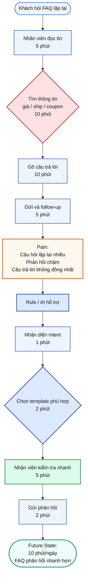

# Day02_2A202600647_NguyenVanChung - AI Product Lab

## Tổng quan

Repo này là bài nộp Day 02 theo hướng **problem first, not AI first**. Case chính được chọn là **tư vấn và phản hồi inbox đa kênh cho shop online nhỏ**. Bài đi từ scan problem cá nhân, hội tụ nhóm, research, workflow trước/sau, Problem Statement, so sánh No AI / Rule / Workflow / Agent, final decision và reflection cá nhân.

## Cấu trúc nội dung

1. **01 - Individual Problem Scan**: scan cá nhân, top 3 problem cards, workflow trước/sau và card muốn pitch.
2. **02 - Group Problem Statement**: hội tụ nhóm, validation, research, workflow before/after, Problem Statement v0/v1, Rule / Workflow / Agent và quyết định cuối.
3. **03 - Individual Reflection**: đóng góp của Chung, cách dùng AI, bài học và nếu làm lại sẽ đổi gì.

## Cấu trúc repo đề xuất

```text
Day02_2A202600647_NguyenVanChung/
├── README.md
├── 01-individual-problem-scan/
│   └── README.md
├── 02-group-problem-statement/
│   └── README.md
└── 03-individual-reflection/
    └── README.md
```

---

## 01 - Individual Problem Scan

### Case: Shop online nhận tin nhắn khách hàng từ nhiều kênh

Một shop online nhỏ thường bán hàng trên nhiều nền tảng khác nhau như Facebook, Zalo, TikTok Shop và Shopee. Mỗi ngày, shop nhận nhiều tin nhắn từ khách hàng về giá sản phẩm, tình trạng hàng, phí vận chuyển, thời gian giao hàng và yêu cầu đổi trả. Vì tin nhắn đến từ nhiều kênh khác nhau, chủ shop hoặc nhân viên dễ bỏ sót khách hàng, phản hồi chậm hoặc nhầm lẫn thông tin đơn hàng.


### Data note

Nguồn dữ liệu dự kiến dùng là Online Shopping Dataset trên Kaggle.

Dataset này được dùng làm dữ liệu tham chiếu để mô phỏng các thông tin shop thường cần tra cứu khi trả lời khách hàng, ví dụ: sản phẩm, giá, phí vận chuyển, coupon/discount và thông tin giao dịch. Dataset này không phải chat log thật, nên các chỉ số như thời gian phản hồi, số tin nhắn bị bỏ sót và tổng thời gian xử lý mỗi ngày là baseline ước lượng, cần validate thêm bằng khảo sát hoặc quan sát thực tế.

---

## Scan rộng

| #  | Lăng kính          | Problem quan sát được                                                                                  | Ai đang đau?               | Dấu hiệu thật                                            |
| -- | ------------------ | ------------------------------------------------------------------------------------------------------ | -------------------------- | -------------------------------------------------------- |
| 1  | Lặp lại            | Mỗi ngày shop phải kiểm tra tin nhắn từ Facebook, Zalo, TikTok Shop và Shopee                          | Chủ shop, nhân viên CSKH   | Phải mở nhiều app nhiều lần trong ngày                   |
| 2  | Lặp lại            | Khách hỏi đi hỏi lại các câu giống nhau như “giá bao nhiêu?”, “còn hàng không?”, “phí ship bao nhiêu?” | Nhân viên CSKH, khách hàng | Câu hỏi FAQ xuất hiện hằng ngày                          |
| 3  | Tốn thời gian      | Nhân viên phải tìm lại thông tin sản phẩm, giá, phí ship, mã giảm giá trước khi trả lời                | Nhân viên CSKH             | Mỗi câu trả lời cần đối chiếu nhiều nguồn dữ liệu        |
| 4  | Tốn thời gian      | Chủ shop phải tổng hợp cuối ngày xem còn khách nào chưa trả lời                                        | Chủ shop                   | Không có dashboard chung cho tất cả kênh                 |
| 5  | AI có thể tốt hơn  | Tin nhắn khách hàng chưa được tự động phân loại theo ý định như hỏi giá, hỏi đơn, hỏi đổi trả          | Nhân viên CSKH             | Tin mua hàng, tin FAQ và tin khiếu nại bị trộn lẫn       |
| 6  | AI có thể tốt hơn  | Shop không biết câu hỏi nào xuất hiện nhiều nhất để cải thiện mô tả sản phẩm                           | Chủ shop                   | Không có thống kê top câu hỏi của khách                  |
| 7  | Pain từ người khác | Khách phải chờ lâu vì shop phản hồi chậm                                                               | Khách hàng                 | Khách có thể chuyển sang shop khác nếu shop phản hồi trễ |
| 8  | Pain từ người khác | Khách nhận câu trả lời sai về giá, phí ship hoặc tình trạng đơn hàng                                   | Khách hàng, chủ shop       | Nhân viên dễ nhầm khi tra cứu thủ công                   |
| 9  | Tốn thời gian      | Yêu cầu đổi trả/khiếu nại phải kiểm tra lại mã đơn, lịch sử mua và chính sách đổi trả                  | Nhân viên CSKH, khách hàng | Một case khiếu nại có thể mất nhiều bước xử lý           |
| 10 | Lặp lại            | Nhân viên mới phải học lại cách trả lời khách theo từng loại câu hỏi                                   | Chủ shop, nhân viên mới    | Onboarding mất thời gian, câu trả lời dễ không đồng nhất |

### Vì sao phần scan này mạnh?

* Có scan rộng trước khi hội tụ.
* Có nhiều lăng kính khác nhau: lặp lại, tốn thời gian, AI có thể tốt hơn, pain từ người khác.
* Mỗi problem có actor và dấu hiệu thật.
* Không bắt đầu bằng “làm chatbot” hoặc “xây agent”.
* Các problem đều gắn với workflow bán hàng online hằng ngày.

---

## Top 3

| Rank | Problem                                                                                      | Vì sao chọn                                       | Điều còn chưa chắc                                       |
| ---- | -------------------------------------------------------------------------------------------- | ------------------------------------------------- | -------------------------------------------------------- |
| 1    | Tin nhắn khách hàng đến từ nhiều kênh, khiến shop dễ bỏ sót, phản hồi chậm và nhầm thông tin | Workflow rõ, xảy ra hằng ngày, có metric tốt      | Cần validate số tin nhắn/ngày và thời gian phản hồi thật |
| 2    | Câu hỏi khách hàng bị lặp lại về giá, tồn kho, phí ship, coupon                              | Có pain thật, có thể dùng rule/template/AI hỗ trợ | Cần biết bao nhiêu phần trăm tin nhắn là FAQ             |
| 3    | Đổi trả và khiếu nại khó theo dõi vì thông tin nằm rải rác nhiều kênh                        | Impact cao, ảnh hưởng trực tiếp đến uy tín shop   | Rủi ro cao hơn, cần người thật quyết định                |

---

## Problem Card #1 - Tin nhắn khách hàng nhiều kênh

**Problem 1 câu:**
Mỗi ngày shop online nhỏ phải kiểm tra tin nhắn khách hàng từ Facebook, Zalo, TikTok Shop và Shopee, trong đó bước đọc, phân loại và tìm thông tin trước khi trả lời tốn nhiều thời gian nhất, dễ làm shop bỏ sót khách hoặc phản hồi sai.

**Actor:**
Chủ shop hoặc nhân viên chăm sóc khách hàng chịu trách nhiệm trả lời khách trên nhiều nền tảng bán hàng.

**Thời điểm / bối cảnh:**
Diễn ra hằng ngày, đặc biệt vào giờ cao điểm bán hàng, khi chạy quảng cáo, livestream hoặc có chương trình khuyến mãi.

**Current workflow:**

```text
1. Kiểm tra Facebook
2. Kiểm tra Zalo
3. Kiểm tra TikTok Shop
4. Kiểm tra Shopee
5. Đọc từng tin nhắn và phân loại: hỏi giá, hỏi tồn kho, hỏi phí ship, hỏi đơn hàng, đổi trả/khiếu nại
6. Tìm thông tin sản phẩm hoặc đơn hàng
7. Trả lời khách thủ công
```

**Bottleneck:**
Bước 5 và 6 - đọc, phân loại tin nhắn và tìm thông tin sản phẩm/đơn hàng. Đây là bottleneck vì nhân viên phải chuyển qua lại nhiều nền tảng, đọc từng tin nhắn, tự hiểu khách đang hỏi gì, rồi tự đối chiếu thông tin sản phẩm, giá, phí ship, coupon hoặc đơn hàng trước khi trả lời.

**Impact:**
Shop mất nhiều thời gian mỗi ngày chỉ để kiểm tra và phản hồi tin nhắn. Khách có nhu cầu mua có thể phải chờ lâu hoặc bị bỏ sót. Nhân viên cũng có thể trả lời nhầm giá, phí vận chuyển, tình trạng hàng hoặc thông tin đơn hàng. Điều này làm giảm trải nghiệm khách hàng và có thể khiến khách chuyển sang shop khác.

**Success metric:**
Giảm tổng thời gian xử lý tin nhắn từ khoảng 75 phút/ngày xuống dưới 30 phút/ngày, không tăng số câu trả lời sai hoặc cần sửa lại.

| Metric                        |             Trước |                Sau kỳ vọng |
| ----------------------------- | ----------------: | -------------------------: |
| Tổng thời gian xử lý tin nhắn |      75 phút/ngày |            25-30 phút/ngày |
| Số nền tảng phải mở thủ công  |        4 nền tảng |              1 inbox chung |
| Thời gian phản hồi FAQ        |        10-30 phút |                Dưới 5 phút |
| Tin nhắn bị bỏ sót cuối ngày  | Chưa kiểm soát rõ |            Dưới 5 tin/ngày |
| Số câu trả lời sai/cần sửa    | Chưa kiểm soát rõ | Không tăng so với hiện tại |

**Non-AI alternative:**
Template trả lời nhanh, auto-reply theo keyword, phân công nhân viên trực từng kênh, checklist cuối ngày hoặc Google Sheet để ghi lại khách cần follow-up. Các cách này có thể giảm một phần công việc, nhưng chưa giải quyết tốt việc phân loại tin nhắn tự nhiên từ nhiều nền tảng và gợi ý trả lời theo dữ liệu shop.

**AI hypothesis:**
AI hỗ trợ phân loại ý định khách hàng và draft câu trả lời dựa trên dữ liệu sản phẩm/đơn hàng. Nhân viên vẫn review, chỉnh sửa và bấm gửi trước khi phản hồi khách.

**Quick gut:**
Workflow.

### Draft current workflow

```text
CURRENT STATE - khoảng 75 phút/ngày

[1 Kiểm tra Facebook: 15']
-> [2 Kiểm tra Zalo: 15']
-> [3 Kiểm tra TikTok Shop: 15']
-> [4 Kiểm tra Shopee: 15']
-> [5 Đọc + phân loại tin nhắn: 10']  <-- bottleneck
-> [6 Tìm thông tin sản phẩm/đơn hàng: 10']  <-- bottleneck
-> [7 Trả lời khách thủ công: 5']
```

### Draft future workflow

```text
FUTURE STATE - khoảng 25-30 phút/ngày

[1 Gom tin nhắn về inbox chung: 2']
-> [2 AI gắn nhãn ý định khách hàng: 3']
-> [3 AI gợi ý câu trả lời: 5']
-> [4 Nhân viên review + chỉnh sửa: 15']  <-- human boundary
-> [5 Gửi phản hồi + nhắc tin chưa xử lý: 3']

Fallback: AI gợi ý sai -> nhân viên tự trả lời thủ công.
```

### Mermaid workflow

```mermaid
flowchart TD
    A([Shop nhận tin nhắn từ nhiều kênh])

    A --> B[Kiểm tra Facebook<br/>15 phút]
    B --> C[Kiểm tra Zalo<br/>15 phút]
    C --> D[Kiểm tra TikTok Shop<br/>15 phút]
    D --> E[Kiểm tra Shopee<br/>15 phút]
    E --> F{Đọc + phân loại<br/>tin nhắn<br/>10 phút}
    F --> G{Tìm thông tin<br/>sản phẩm / đơn hàng<br/>10 phút}
    G --> H[Trả lời khách thủ công<br/>5 phút]

    H --> I[Pain:<br/>Dễ bỏ sót khách<br/>Phản hồi chậm<br/>Nhầm thông tin đơn hàng]

    I --> J[AI Workflow cải thiện]

    J --> K[Gom tin nhắn về<br/>1 inbox chung<br/>2 phút]
    K --> L{AI gắn nhãn<br/>ý định khách hàng<br/>3 phút}
    L --> M{AI gợi ý<br/>câu trả lời<br/>5 phút}
    M --> N[Nhân viên review<br/>và chỉnh sửa<br/>15 phút]
    N --> O[Gửi phản hồi<br/>+ nhắc tin chưa xử lý<br/>3 phút]
    O --> P([Future State:<br/>25-30 phút/ngày<br/>Ít bỏ sót hơn])

    classDef normal fill:#EEF4FF,stroke:#2563EB,stroke-width:1.5px,color:#111827;
    classDef bottleneck fill:#FEE2E2,stroke:#DC2626,stroke-width:2px,color:#111827;
    classDef ai fill:#DBEAFE,stroke:#1D4ED8,stroke-width:2px,color:#111827;
    classDef human fill:#DCFCE7,stroke:#16A34A,stroke-width:2px,color:#111827;
    classDef pain fill:#FFF7ED,stroke:#EA580C,stroke-width:2px,color:#111827;
    classDef result fill:#ECFDF5,stroke:#059669,stroke-width:2px,color:#111827;

    class A,B,C,D,E,H,K,O normal;
    class F,G bottleneck;
    class J,L,M ai;
    class N human;
    class I pain;
    class P result;
```



---

## Problem Cards #2 và #3 - tóm tắt

| Card                              | Actor                                | Bottleneck                                           | Metric                           | Quick gut       | Vì sao chưa chọn làm #1                                     |
| --------------------------------- | ------------------------------------ | ---------------------------------------------------- | -------------------------------- | --------------- | ----------------------------------------------------------- |
| Câu hỏi khách hàng bị lặp lại     | Nhân viên CSKH                       | Tìm thông tin giá/ship/coupon rồi gõ lại câu trả lời | 30 phút/ngày -> dưới 10 phút/ngày | Rule / Workflow | Có thể chỉ cần template hoặc rule, scope hẹp hơn            |
| Đổi trả và khiếu nại khó theo dõi | Chủ shop, nhân viên CSKH, khách hàng | Tìm mã đơn, lịch sử mua và theo dõi trạng thái xử lý | 35 phút/case -> dưới 15 phút/case | Workflow        | Rủi ro cao hơn, cần người thật quyết định hoàn tiền/đổi trả |

### Draft workflow - Problem Card #2

```text
CURRENT STATE - khoảng 30 phút/ngày

[1 Khách hỏi FAQ]
-> [2 Nhân viên đọc tin: 5']
-> [3 Tìm thông tin giá/ship/coupon: 10']  <-- bottleneck
-> [4 Gõ câu trả lời: 10']
-> [5 Gửi và follow-up: 5']

FUTURE STATE - khoảng 10 phút/ngày

[1 Khách hỏi FAQ]
-> [2 Rule/AI nhận diện intent: 1']
-> [3 Chọn template phù hợp: 2']
-> [4 Nhân viên kiểm tra nhanh: 5']  <-- human boundary
-> [5 Gửi phản hồi: 2']

Fallback: Không đủ dữ liệu hoặc không phải FAQ -> chuyển người thật xử lý.
```

### Mermaid workflow - Problem Card #2



### Draft workflow - Problem Card #3

```text
CURRENT STATE - khoảng 35 phút/case

[1 Khách nhắn khiếu nại: 2']
-> [2 Nhân viên đọc + hỏi thêm thông tin: 5']
-> [3 Tìm mã đơn/lịch sử mua: 15']  <-- bottleneck
-> [4 Kiểm tra chính sách đổi trả: 5']
-> [5 Chọn hướng xử lý: 5']
-> [6 Theo dõi thủ công: 3']

FUTURE STATE - khoảng 15 phút/case

[1 Tin khiếu nại vào inbox chung: 1']
-> [2 AI nhận diện case đổi trả/khiếu nại: 1']
-> [3 AI tóm tắt vấn đề + trích mã đơn: 2']
-> [4 Nhân viên kiểm tra thông tin đơn hàng: 5']  <-- human boundary
-> [5 Nhân viên chọn hướng xử lý: 5']  <-- human boundary
-> [6 Hệ thống gắn trạng thái follow-up: 1']

Fallback: AI không đủ dữ liệu -> nhân viên xử lý thủ công.
```

### Mermaid workflow - Problem Card #3

```mermaid
flowchart TD
    A([Khách gửi yêu cầu<br/>đổi trả / khiếu nại])
    A --> B[Nhân viên đọc tin<br/>2 phút]
    B --> C[Hỏi thêm thông tin<br/>5 phút]
    C --> D{Tìm mã đơn<br/>và lịch sử mua<br/>15 phút}
    D --> E[Kiểm tra chính sách đổi trả<br/>5 phút]
    E --> F[Chọn hướng xử lý<br/>5 phút]
    F --> G[Theo dõi thủ công<br/>3 phút]
    G --> H[Pain:<br/>Xử lý chậm<br/>Dễ quên follow-up<br/>Ảnh hưởng uy tín shop]

    H --> I[AI Workflow hỗ trợ]
    I --> J[Tin khiếu nại vào<br/>inbox chung<br/>1 phút]
    J --> K{AI nhận diện case<br/>đổi trả / khiếu nại<br/>1 phút}
    K --> L{AI tóm tắt vấn đề<br/>+ trích mã đơn<br/>2 phút}
    L --> M[Nhân viên kiểm tra<br/>thông tin đơn hàng<br/>5 phút]
    M --> N[Nhân viên chọn<br/>hướng xử lý<br/>5 phút]
    N --> O[Hệ thống gắn<br/>trạng thái follow-up<br/>1 phút]
    O --> P([Future State:<br/>15 phút/case<br/>Case rõ trạng thái hơn])

    classDef normal fill:#EEF4FF,stroke:#2563EB,stroke-width:1.5px,color:#111827;
    classDef bottleneck fill:#FEE2E2,stroke:#DC2626,stroke-width:2px,color:#111827;
    classDef ai fill:#DBEAFE,stroke:#1D4ED8,stroke-width:2px,color:#111827;
    classDef human fill:#DCFCE7,stroke:#16A34A,stroke-width:2px,color:#111827;
    classDef pain fill:#FFF7ED,stroke:#EA580C,stroke-width:2px,color:#111827;
    classDef result fill:#ECFDF5,stroke:#059669,stroke-width:2px,color:#111827;

    class A,B,C,E,F,G,J,O normal;
    class D bottleneck;
    class I,K,L ai;
    class M,N human;
    class H pain;
    class P result;
```



---

## Card muốn pitch

### Card muốn pitch

Problem Card #1 - Tin nhắn khách hàng nhiều kênh.

### Vì sao chọn card này

Tôi chọn card này vì đây là bài toán có workflow rõ nhất, xảy ra hằng ngày và có thể đo được bằng metric cụ thể. Pain chính không chỉ là khách nhắn nhiều, mà là tin nhắn đến từ nhiều nền tảng khác nhau, khiến shop phải kiểm tra thủ công, dễ bỏ sót khách, phản hồi chậm và nhầm thông tin đơn hàng.

Bài toán này cũng phù hợp để so sánh Rule / Workflow / Agent:

* Rule có thể hỗ trợ FAQ đơn giản.
* Workflow phù hợp nhất vì cần gom tin, phân loại, gợi ý trả lời và người thật review.
* Agent chưa phù hợp vì rủi ro nếu AI tự trả lời sai, tự hứa đổi trả hoặc xử lý nhầm đơn hàng.

### Pitch 60 giây

Một shop online nhỏ bán hàng trên Facebook, Zalo, TikTok Shop và Shopee. Mỗi ngày shop nhận nhiều tin nhắn về giá, tình trạng hàng, phí ship, thời gian giao hàng và đổi trả. Hiện tại, chủ shop hoặc nhân viên phải mở từng nền tảng, đọc từng tin, tự phân loại rồi tìm thông tin trước khi trả lời khách. Bottleneck nằm ở bước đọc, phân loại và tìm thông tin sản phẩm/đơn hàng. Việc này khiến shop mất khoảng 75 phút/ngày, dễ bỏ sót khách và phản hồi chậm. Tôi đề xuất không làm Agent tự trả lời toàn bộ, mà chọn Workflow: gom tin nhắn về một inbox chung, AI phân loại ý định và gợi ý câu trả lời, sau đó nhân viên review trước khi gửi.

### Câu hỏi muốn nhóm challenge

1. Với shop nhỏ, bài toán này có thật sự cần AI không hay chỉ cần inbox chung và template?
2. Những loại tin nhắn nào AI được phép gợi ý trả lời?
3. Case nào bắt buộc chuyển người thật xử lý?
4. Baseline 75 phút/ngày có hợp lý không, cần đo lại bằng cách nào?
5. Nếu chỉ pilot 1-2 kênh trước, nên chọn Facebook/Zalo hay Shopee/TikTok Shop?
6. Success metric nào quan trọng hơn: giảm thời gian xử lý, giảm tin bỏ sót hay giảm phản hồi sai?


---

## 02 - Group Problem Statement


> **Case nhóm chọn:** Tư vấn và phản hồi inbox đa kênh cho shop online nhỏ


Một shop online nhỏ bán hàng trên nhiều kênh như Facebook, Zalo, TikTok Shop và Shopee. Mỗi ngày shop nhận nhiều tin nhắn khách hàng về giá sản phẩm, tình trạng hàng, size, phí vận chuyển, thời gian giao hàng, trạng thái đơn và yêu cầu đổi trả. Vì tin nhắn nằm rải rác ở nhiều nền tảng, chủ shop hoặc nhân viên CSKH phải kiểm tra thủ công từng app, đọc từng tin, phân loại ý định khách hỏi, tra thông tin sản phẩm hoặc đơn hàng rồi mới trả lời.


**Pain chính** không chỉ là "khách nhắn nhiều", mà là việc shop phải xử lý inbox đa kênh trong khi nhân sự ít. Điều này khiến shop dễ bỏ sót khách, phản hồi chậm, trả lời không đồng nhất hoặc nhầm thông tin sản phẩm, size, giá, tồn kho và trạng thái đơn hàng.


---


### 1. Group convergence


Nhóm có 3 người. Mỗi người share 3 problem candidates từ phần cá nhân, tổng cộng 9 candidates. Sau đó nhóm gom các candidate có pattern giống nhau thành các cluster.


#### 1.1 Danh sách 9 candidates ban đầu


| # | Người đưa ra | Candidate problem | Người gặp vấn đề | Điểm nghẽn |
|---|---|---|---|---|
| 1 | Chung | Tin nhắn khách hàng nhiều kênh | Chủ shop / nhân viên CSKH | Phải kiểm tra Facebook, Zalo, TikTok Shop, Shopee thủ công |
| 2 | Chung | Câu hỏi khách hàng bị lặp lại | Nhân viên CSKH | Phải trả lời lại các câu hỏi về giá, tồn kho, phí ship, coupon |
| 3 | Chung | Đổi trả và khiếu nại khó theo dõi | Chủ shop / CSKH / khách hàng | Phải tìm mã đơn, lịch sử mua và trạng thái xử lý |
| 4 | Kỳ | Tư vấn và chốt đơn inbox đa kênh | Chủ shop thời trang online | Trả lời lặp, tư vấn size, phản hồi chậm làm mất đơn |
| 5 | Kỳ | Gom và bàn giao đơn đa kênh | Chủ shop / người đóng gói | Đơn chốt qua chat phải ghi tay, dễ sót hoặc nhầm size/mẫu |
| 6 | Kỳ | Tổng hợp review xấu để cải thiện sản phẩm | Chủ shop | Review rải rác nhiều sàn, khó biết sản phẩm nào hay lỗi |
| 7 | Danh | Khách hỏi giá nhiều kiểu | Nhân viên CSKH | Phải hiểu khách hỏi sản phẩm nào rồi tra giá và gõ lại |
| 8 | Danh | Tìm lại lịch sử chat của khách | Nhân viên CSKH | Phải cuộn/tìm thủ công lịch sử mua hoặc câu hỏi cũ |
| 9 | Danh | Soạn email khiếu nại hàng lỗi/giao sai | Nhân viên CSKH | Phải sửa template theo từng case, dễ mất thời gian |


#### 1.2 Gom trùng / cluster


| Cluster | Candidates included | Pattern chung | Ghi chú |
|---|---|---|---|
| Inbox / CSKH đa kênh | #1, #4, #7 | Khách hỏi nhiều qua nhiều kênh; shop phải đọc, hiểu ý, tra thông tin và trả lời thủ công | Đây là cluster mạnh nhất vì xuất hiện trong cả 3 bài cá nhân |
| FAQ / tư vấn lặp lại | #2, #4, #7 | Nhiều câu hỏi lặp lại như giá, tồn kho, phí ship, size nhưng khách hỏi bằng nhiều cách khác nhau | Có thể dùng Rule cho case đơn giản và AI cho câu hỏi tự nhiên |
| Gom đơn / handoff đóng gói | #5 | Đơn chốt qua chat cần chuyển sang file xử lý, dễ sót hoặc nhầm | Pain rõ nhưng nghiêng về tool/POS hơn AI |
| Khiếu nại / đổi trả | #3, #9 | Cần tìm đơn hàng, kiểm tra chính sách và phản hồi khéo | Impact cao nhưng rủi ro cao, cần người thật quyết định |
| Review / insight sản phẩm | #6 | Review xấu nằm rải rác, cần tổng hợp để cải thiện sản phẩm | AI hợp nhưng outcome dài hạn, khó đo trong lab |
| Lịch sử khách hàng | #8 | Cần tìm lại thông tin khách cũ nhưng phải thao tác thủ công | Phụ thuộc API/history, scope kỹ thuật rộng |


#### 1.3 Nhận xét sau khi gom cluster


Ba bài cá nhân đều hội tụ vào một pattern chung: **CSKH online bị quá tải vì thông tin khách hàng và tin nhắn nằm rải rác ở nhiều kênh.**


- **Bài của Chung** nhấn mạnh vấn đề đa kênh: Facebook, Zalo, TikTok Shop, Shopee.
- **Bài của Kỳ** có số liệu mạnh hơn về shop thời trang: 100-150 tin/ngày, nhiều câu hỏi lặp, mất đơn vì phản hồi chậm.
- **Bài của Danh** bổ sung góc CSKH: hỏi giá nhiều kiểu, tìm lịch sử chat lâu, email khiếu nại và áp lực từ phản hồi chậm.


Vì vậy, nhóm không chọn một bài quá hẹp như "hỏi giá bao nhiêu" hay "gom đơn cuối ngày", mà chọn candidate rộng vừa đủ: **Tư vấn và phản hồi inbox đa kênh cho shop online nhỏ.**


---


### 2. Shortlist và score


#### 2.1 Shortlist


| Candidate | Vì sao vào shortlist | Rủi ro / điều chưa rõ |
|---|---|---|
| Tư vấn và phản hồi inbox đa kênh | Workflow rõ, xuất hiện trong cả 3 bài cá nhân, có số liệu thời gian và tần suất | Cần gom baseline từ nhiều nguồn thành một baseline thống nhất |
| Gom và bàn giao đơn đa kênh | Handoff rõ, impact vận hành rõ | Có thể dùng POS/tool sẵn, phần AI không nhiều |
| Tìm lại lịch sử chat của khách | Tốn thời gian, liên quan đa kênh | Phụ thuộc API và quyền truy cập lịch sử chat |
| Tổng hợp review xấu để cải thiện sản phẩm | AI phù hợp để đọc hiểu và phân loại review | Impact dài hạn, khó đo trong 4 tiếng lab |
| Soạn email khiếu nại | Workflow rõ, có thể dùng AI để draft | Tần suất thấp hơn inbox hằng ngày |


#### 2.2 Score để đồng thuận


Chấm 1-5. Điểm không phải tuyệt đối, mục tiêu là ép nhóm nói rõ lý do chọn.


| Candidate | Actor rõ | Workflow rõ | Pain có evidence | Impact đo được | Làm trong lab | So sánh R/W/A được | Nhóm hiểu domain | **Tổng** |
|---|:--:|:--:|:--:|:--:|:--:|:--:|:--:|:--:|
| Tư vấn và phản hồi inbox đa kênh | 5 | 5 | 4 | 5 | 4 | 5 | 5 | **33** |
| Gom và bàn giao đơn đa kênh | 5 | 5 | 4 | 4 | 4 | 3 | 5 | **30** |
| Tìm lại lịch sử chat của khách | 4 | 4 | 4 | 4 | 3 | 4 | 4 | **27** |
| Tổng hợp review xấu để cải thiện sản phẩm | 4 | 4 | 3 | 4 | 4 | 5 | 4 | **28** |
| Soạn email khiếu nại | 4 | 4 | 3 | 3 | 5 | 4 | 4 | **27** |


#### 2.3 Candidate nhóm chọn


> **Tư vấn và phản hồi inbox đa kênh cho shop online nhỏ.**


#### 2.4 Vì sao chọn


- Có actor rõ: chủ shop hoặc nhân viên CSKH.
- Có workflow lặp lại hằng ngày.
- Có bottleneck cụ thể: đọc/phân loại tin nhắn, tra thông tin sản phẩm/đơn hàng và gõ câu trả lời.
- Có evidence từ nhiều thành viên: số lượng tin nhắn lớn, câu hỏi lặp lại nhiều, phản hồi chậm gây mất khách hoặc review xấu.
- Có impact đo được: thời gian xử lý inbox, thời gian phản hồi đầu tiên, số đơn mất do trả lời chậm, số câu trả lời sai/cần sửa.
- Có thể so sánh rõ No AI / Rule / Workflow / Agent.
- Có thể pilot nhỏ trong lab bằng dữ liệu tin nhắn mẫu và bảng sản phẩm/giá/size.


#### 2.5 Vì sao không chọn các candidate còn lại


- **Gom và bàn giao đơn đa kênh:** pain thật và workflow rõ, nhưng phần lớn có thể giải bằng tool/POS gom đơn có sẵn. AI chỉ phụ ở bước trích thông tin từ chat, nên không phải candidate tốt nhất cho bài Rule/Workflow/Agent.
- **Tìm lại lịch sử chat của khách:** có pain thật nhưng phụ thuộc nhiều vào quyền truy cập API/history của từng nền tảng, scope kỹ thuật có thể vượt lab.
- **Tổng hợp review xấu:** AI rất hợp để đọc và phân loại review, nhưng impact dài hạn hơn, khó đo ngay trong 4 tiếng lab.
- **Soạn email khiếu nại:** làm được bằng workflow/template, nhưng tần suất thấp hơn so với inbox hỏi giá/size/ship hằng ngày.


#### 2.6 Nếu có disagreement, nhóm xử lý thế nào


Nhóm có thảo luận giữa 2 hướng: "gom đơn đa kênh" và "tư vấn inbox đa kênh". Sau khi so sánh, nhóm chọn "tư vấn inbox đa kênh" vì bài này xảy ra hằng ngày, liên quan trực tiếp đến phản hồi khách, có thể đo thời gian rõ hơn và có thể so sánh Rule / Workflow / Agent tốt hơn. "Gom đơn" được giữ lại như một bước hoặc candidate phụ, không phải trọng tâm.


---


### 3. Quick validation


#### 3.1 Nguồn validation


| Nguồn | Số người / số mẫu | Tín hiệu xác nhận | Tín hiệu phản bác | Nhóm sửa problem thế nào |
|---|---|---|---|---|
| Bài cá nhân của Kỳ | 1 shop thời trang online | Shop có khoảng 100-150 tin/ngày, khoảng 65% là câu hỏi lặp; mất khoảng 3h/ngày để chat; có thể mất 5-10 đơn/tuần do trả lời chậm | Một số phần như gom đơn có thể dùng tool/POS, không cần AI nhiều | Không chọn "gom đơn" làm core; chọn "tư vấn và phản hồi inbox đa kênh" |
| Bài cá nhân của Chung | 1 case shop online đa kênh | Tin nhắn đến từ Facebook, Zalo, TikTok Shop, Shopee; bottleneck là đọc/phân loại tin và tìm thông tin sản phẩm/đơn hàng | Baseline 75 phút/ngày là ước lượng, cần đo thật | Ghi rõ baseline nhóm là baseline tổng hợp, cần validate trên một shop cụ thể |
| Bài cá nhân của Danh | 1 case CSKH online | CSKH nhận 50-70 tin/ngày; hỏi giá 20-30 lần/ngày; hỏi còn hàng 15-20 lần/ngày; phản hồi chậm từng gây đánh giá xấu | Danh tập trung vào mỹ phẩm/son, chưa bao phủ đầy đủ shop thời trang đa kênh | Dùng dữ liệu Danh để bổ sung nhóm intent FAQ, không lấy làm toàn bộ domain |
| Thảo luận nhóm | 3 thành viên | Cả 3 đều đồng ý vấn đề inbox/FAQ đa kênh dễ hiểu, workflow rõ, đo được | Chưa có log tin nhắn thật từ một shop duy nhất | Pilot sẽ dùng dữ liệu tin nhắn mẫu hoặc dữ liệu mô phỏng trước, chưa tích hợp live |


#### 3.2 Insight sau validation


Pain thật không chỉ nằm ở việc "khách hỏi nhiều". Pain nằm ở việc shop phải xử lý nhiều loại câu hỏi từ nhiều kênh cùng lúc: hỏi giá, còn hàng, phí ship, size, trạng thái đơn, đổi trả. Khi không có inbox chung và không có hệ thống phân loại, chủ shop/CSKH phải tự đọc, tự tra, tự gõ lại, dẫn đến phản hồi chậm, dễ mất đơn và dễ trả lời sai.


#### 3.3 Problem scope sau khi sửa


Nhóm thu hẹp scope như sau.


**Không làm:**


- "AI chatbot tự bán hàng toàn bộ".
- "Agent tự chốt đơn, tự đổi trả, tự hoàn tiền".
- Hệ thống tích hợp live đầy đủ 4 nền tảng trong lab.


**Chỉ làm workflow hỗ trợ:**


> Gom tin nhắn mẫu -> phân loại intent -> gợi ý câu trả lời -> người thật review -> gửi.


#### 3.4 Giả định cần ghi rõ


- Baseline 120 phút/ngày là baseline tổng hợp từ các bài cá nhân, chưa phải số đo từ một shop duy nhất.
- Số đơn mất do phản hồi chậm là ước lượng từ trải nghiệm shop cá nhân, cần kiểm chứng thêm.
- Dữ liệu pilot có thể là tin nhắn mẫu hoặc tin mô phỏng, chưa phải dữ liệu live.
- Chưa triển khai API thật trong lab; nếu tích hợp thật cần kiểm tra quyền API và chính sách từng nền tảng.


---


### 4. Research giải pháp đã có


Nhóm tìm các tool/pattern có sẵn để không nghĩ trong chân không. Các link bên dưới là nguồn tham khảo để nhóm hiểu pattern giải pháp hiện có; trước khi triển khai thật cần kiểm tra lại tài liệu chính thức và quyền API của từng nền tảng.


| Nguồn / tool / case | Link | Họ giải quyết phần nào? | Điểm mạnh | Khoảng trống / rủi ro | Bài học cho nhóm |
|---|---|---|---|---|---|
| Meta Business Suite Inbox | [link](https://www.facebook.com/business/help/294426838452244) | Quản lý tin nhắn trong hệ Meta như Messenger, Instagram, WhatsApp | Tốt nếu shop bán chủ yếu trên Facebook/Instagram | Không gom được Zalo, Shopee, TikTok Shop | Inbox chung là hướng đúng, nhưng cần nhìn đa nền tảng |
| Zalo OA Webhook / OpenAPI | [link](https://developers.zalo.me/docs/official-account/webhook/tong-quan) | Cho phép hệ thống nhận sự kiện/tương tác từ Zalo OA qua webhook | Có thể tích hợp Zalo vào workflow riêng | Cần OA, app, quyền API và kỹ thuật tích hợp | Zalo có thể là một nguồn dữ liệu trong workflow, nhưng không nên pilot live ngay |
| Shopee Auto-Reply | [link](https://seller.shopee.sg/edu/article/20316/auto-reply) | Tự động gửi tin nhắn trả lời khi người mua nhắn tin mới | Hữu ích cho câu chào, FAQ đơn giản, ngoài giờ làm việc | Chỉ nằm trong Shopee, không hiểu sâu ngữ cảnh, khó tư vấn size/chốt đơn phức tạp | Rule/auto-reply đủ cho một phần FAQ, chưa đủ cho toàn bộ workflow |
| TikTok Shop Customer Service Chat Assistant | [link](https://seller-vn.tiktok.com/university/course?content_id=1531423807063809&lang=en&learning_id=7986455721625360) | Auto-reply, recommended answers, chatbot functions cho CSKH TikTok Shop | Pattern tốt: gợi ý câu trả lời, tăng hiệu suất CSKH | Nằm trong TikTok Shop, không giải quyết đa kênh ngoài nền tảng | Nên thiết kế AI như assistant gợi ý, không phải agent tự quyết |
| TikTok Shop Customer Service API | [link](https://partner.tiktokshop.com/docv2/page/customer-service-api-overview) | Có thể forwarding tin nhắn buyer sang hệ thống CSKH bên thứ ba | Hữu ích nếu sau này muốn tích hợp thật | Cần quyền API, setup kỹ thuật, không phù hợp pilot 4 tiếng | Pilot nên mô phỏng bằng Google Sheet trước khi tích hợp API thật |
| POS / inbox tool đa kênh | _Cần verify theo tool cụ thể: Pancake, Abit, Harasocial hoặc tương tự_ | Gom hội thoại, đơn hàng, khách hàng về một nơi | Có thể giải quyết một phần vận hành đa kênh | Có chi phí, phụ thuộc nền tảng, không phải lúc nào cũng có AI hiểu ngữ cảnh | Non-AI/tool có thể giải một phần, nên AI chỉ cần hỗ trợ bước hiểu/gợi ý |


#### 4.1 Research takeaway


Không nên build Agent tự xử lý toàn bộ khách hàng ngay từ đầu. Các tool hiện có cho thấy pattern tốt là: **gom tin -> auto-reply -> gợi ý câu trả lời -> người thật kiểm tra.** Vì vậy hướng hợp lý nhất là **Workflow**: Rule hoặc tool gom tin, AI phân loại và gợi ý trả lời, nhân viên CSKH/chủ shop review trước khi gửi.


---


### 5. Workflow before/after


#### 5.1 Current workflow (bản nhóm)


**CURRENT STATE - khoảng 120 phút/ngày, chủ yếu dồn vào giờ cao điểm**


```text
[1 Kiểm tra Facebook/Zalo/Shopee/TikTok: 35']
 -> [2 Đọc tin nhắn và hiểu khách hỏi gì: 20']
 -> [3 Phân loại intent: giá / tồn kho / ship / size / đơn hàng / khiếu nại: 15']   <-- bottleneck
 -> [4 Tra thông tin sản phẩm, bảng giá, size, tồn kho, phí ship, đơn hàng: 25']    <-- bottleneck
 -> [5 Gõ câu trả lời thủ công: 20']                                                <-- bottleneck
 -> [6 Nếu chốt đơn, ghi lại thông tin hoặc chuyển cho người đóng gói: 5']
```


**Rủi ro hiện tại:**


- Trả lời chậm vào buổi tối/giờ sale.
- Dễ bỏ sót khách.
- Dễ tư vấn sai size/giá/tồn kho.
- Không biết tin nào cần ưu tiên.


#### 5.2 Bảng current workflow chi tiết


| Bước | Actor | Input | Output | Thời gian/tần suất | Handoff / Ghi chú |
|:--:|---|---|---|---|---|
| 1 | Chủ shop / CSKH | Tin nhắn từ Facebook, Zalo, TikTok Shop, Shopee | Danh sách tin cần xử lý | 35 phút/ngày | Không có inbox chung, phải mở nhiều app |
| 2 | Chủ shop / CSKH | Nội dung tin nhắn | Hiểu khách đang hỏi gì | 20 phút/ngày | Khách hỏi nhiều kiểu, viết tắt, sai chính tả |
| 3 | Chủ shop / CSKH | Tin nhắn đã đọc | Nhóm intent: giá, tồn kho, ship, size, đơn hàng, khiếu nại | 15 phút/ngày | **Bottleneck** vì phải tự phân loại |
| 4 | Chủ shop / CSKH | Intent + câu hỏi | Thông tin đúng từ bảng giá, tồn kho, size chart, phí ship, đơn hàng | 25 phút/ngày | **Bottleneck** vì dữ liệu nằm nhiều nơi |
| 5 | Chủ shop / CSKH | Thông tin đã tra | Câu trả lời cho khách | 20 phút/ngày | **Bottleneck** vì nhiều câu lặp lại nhưng vẫn phải gõ thủ công |
| 6 | Chủ shop / CSKH | Khách xác nhận mua | Thông tin đơn hoặc trạng thái follow-up | 5 phút/ngày | Nếu chốt đơn thì chuyển sang file đơn cho người đóng gói |


#### 5.3 Bottleneck chính


Bottleneck chính nằm ở **bước 3-5**: phân loại intent, tra thông tin và gõ câu trả lời. Đây là phần tốn thời gian nhất vì tin nhắn đến từ nhiều kênh, khách hỏi bằng nhiều cách khác nhau, và câu trả lời cần đúng dữ liệu sản phẩm/size/ship/đơn hàng.


#### 5.4 Future workflow (bản nhóm)


**FUTURE STATE - mục tiêu 50-60 phút/ngày**


```text
[1 Tin nhắn mẫu được gom vào inbox/Google Sheet: 5']                                  -- Rule/tool/manual pilot
 -> [2 AI phân loại intent: giá / tồn kho / ship / size / đơn hàng / khiếu nại: 5']   -- Workflow/AI
 -> [3 AI tra bảng sản phẩm/giá/tồn kho/size chart/chính sách ship & gợi ý trả lời: 10'] -- Workflow/AI
 -> [4 Chủ shop/CSKH review, sửa nếu cần: 25-35']                                     -- Human boundary
 -> [5 Gửi phản hồi + đánh dấu trạng thái / chuyển đơn chốt sang file đóng gói: 5']   -- Rule/tool
```


**Fallback:**


- Nếu AI không chắc, thiếu dữ liệu, câu hỏi nhạy cảm, khiếu nại hoặc đổi trả -> gắn cờ "cần người xử lý".
- Nếu AI gợi ý sai -> CSKH bỏ gợi ý và trả lời thủ công.


**Bottleneck mới:** Chủ shop/CSKH review và chỉnh sửa. Đây là bottleneck chấp nhận được vì đó là điểm kiểm soát chất lượng trước khi phản hồi khách.


#### 5.5 Bảng future workflow chi tiết


| Bước | Actor | Input | Output | Thời gian/tần suất | Handoff / Ghi chú |
|:--:|---|---|---|---|---|
| 1 | Rule/tool/manual pilot | Tin nhắn từ các kênh | Một inbox hoặc Google Sheet chung | 5 phút/ngày | Pilot có thể copy thủ công, chưa cần API |
| 2 | AI | Tin nhắn text | Intent: hỏi giá, tồn kho, ship, size, đơn hàng, khiếu nại | 5 phút/ngày | AI hỗ trợ phân loại |
| 3 | AI | Intent + bảng sản phẩm + bảng giá + tồn kho + size chart + chính sách ship | Draft câu trả lời | 10 phút/ngày | AI chỉ gợi ý, không tự gửi |
| 4 | Chủ shop / CSKH | Draft từ AI | Câu trả lời đã được kiểm tra | 25-35 phút/ngày | Human boundary, người thật chịu trách nhiệm cuối |
| 5 | Chủ shop / CSKH + rule | Câu trả lời đã duyệt | Gửi khách, đánh dấu trạng thái, chuyển đơn chốt sang file đóng gói nếu có | 5 phút/ngày | Handoff sang người đóng gói nếu khách đã chốt đơn |


#### 5.6 Before/after impact (có cách đo)


| Metric | Baseline hiện tại | Target sau pilot | Cách đo | Ghi chú |
|---|---|---|---|---|
| Tổng thời gian xử lý inbox/ngày | Khoảng 120 phút/ngày | 50-60 phút/ngày | Bấm giờ từ lúc bắt đầu check inbox đến khi xử lý xong batch tin trong 3 ngày | Baseline tổng hợp từ 3 bài cá nhân, cần đo lại trên 1 shop cụ thể |
| Thời gian phản hồi FAQ giờ cao điểm | 10-25 phút | Dưới 5 phút | Lấy timestamp tin nhắn khách và timestamp phản hồi đầu tiên | FAQ gồm giá, tồn kho, ship, size cơ bản |
| Thời gian xử lý một tin lặp | 30-90 giây/tin | Dưới 30 giây/tin | Chọn 50 tin FAQ, đo thời gian từ lúc đọc đến lúc có câu trả lời đã duyệt | Không tính case khiếu nại phức tạp |
| Tỷ lệ AI phân loại intent đúng | Chưa có | >= 85% | Người thật gán nhãn chuẩn cho 50-100 tin, so với nhãn AI | Intent: giá, tồn kho, ship, size, đơn hàng, khiếu nại |
| Tỷ lệ câu trả lời AI dùng được sau chỉnh nhẹ | Chưa có | >= 70% | CSKH đánh dấu: dùng được / cần sửa nhẹ / phải viết lại | "Dùng được" nghĩa là không sai thông tin chính |
| Tin nhắn bị bỏ sót cuối ngày | Có rủi ro cao | Dưới 2-5 tin/ngày | Đếm tin chưa có trạng thái "đã xử lý" cuối ngày | Cần dashboard/Sheet trạng thái |
| Đơn mất do phản hồi chậm | Ước lượng 5-10 đơn/tuần | Dưới 2 đơn/tuần | Chủ shop ghi lại case khách hỏi rồi không phản hồi/mua trong 24h | Metric phụ, cần validate thêm |
| Lỗi nghiêm trọng do AI | Chưa có | 0 lỗi | Log các câu AI gợi ý sai giá, sai size, sai tồn kho, sai chính sách | Nếu có lỗi nghiêm trọng thì không dùng live |


#### 5.7 Mermaid workflow

```mermaid
flowchart TD
   A([Tin nhắn khách hàng từ nhiều kênh])


   A --> B[Kiểm tra Facebook / Zalo / Shopee / TikTok<br/>35 phút]
   B --> C[Đọc tin và hiểu khách hỏi gì<br/>20 phút]
   C --> D{Phân loại intent<br/>giá / tồn kho / ship / size / đơn hàng / khiếu nại<br/>15 phút}
   D --> E{Tra thông tin sản phẩm / size / ship / đơn hàng<br/>25 phút}
   E --> F[Gõ câu trả lời thủ công<br/>20 phút]
   F --> G[Chốt đơn hoặc đánh dấu follow-up<br/>5 phút]


   G --> H[Pain:<br/>Phản hồi chậm<br/>Dễ bỏ sót khách<br/>Dễ nhầm giá / size / tồn kho]


   H --> I[Workflow có AI hỗ trợ]


   I --> J[Gom tin nhắn vào inbox / Google Sheet chung<br/>5 phút]
   J --> K{AI phân loại intent<br/>5 phút}
   K --> L{AI gợi ý câu trả lời<br/>dựa trên dữ liệu shop<br/>10 phút}
   L --> M[CSKH / chủ shop review và chỉnh sửa<br/>25-35 phút]
   M --> N[Gửi phản hồi + đánh dấu trạng thái<br/>5 phút]
   N --> O([Future State:<br/>50-60 phút/ngày<br/>Phản hồi nhanh hơn<br/>Ít bỏ sót hơn])


   classDef normal fill:#EEF4FF,stroke:#2563EB,stroke-width:1.5px,color:#111827;
   classDef bottleneck fill:#FEE2E2,stroke:#DC2626,stroke-width:2px,color:#111827;
   classDef ai fill:#DBEAFE,stroke:#1D4ED8,stroke-width:2px,color:#111827;
   classDef human fill:#DCFCE7,stroke:#16A34A,stroke-width:2px,color:#111827;
   classDef pain fill:#FFF7ED,stroke:#EA580C,stroke-width:2px,color:#111827;
   classDef result fill:#ECFDF5,stroke:#059669,stroke-width:2px,color:#111827;


   class A,B,C,F,G,J,N normal;
   class D,E bottleneck;
   class I,K,L ai;
   class M human;
   class H pain;
   class O result;
```





---


### 6. Problem Statement v0


| Field | Nội dung |
|---|---|
| **Actor** | Chủ shop hoặc nhân viên CSKH của shop online nhỏ bán hàng đa kênh. |
| **Workflow** | Mỗi ngày shop kiểm tra tin nhắn từ Facebook, Zalo, TikTok Shop, Shopee; đọc tin; phân loại câu hỏi; tra thông tin sản phẩm/size/ship/đơn hàng; gõ câu trả lời; chốt đơn hoặc đánh dấu follow-up. |
| **Bottleneck** | Bước phân loại intent, tra thông tin và gõ câu trả lời tốn thời gian nhất, đặc biệt khi khách hỏi nhiều kiểu, viết tắt, sai chính tả hoặc hỏi size/đơn hàng. |
| **Impact** | Shop mất khoảng 120 phút/ngày để xử lý inbox; có rủi ro mất 5-10 đơn/tuần do phản hồi chậm; khách có thể nhận câu trả lời sai về giá, size, tồn kho hoặc trạng thái đơn. |
| **Success Metric** | Giảm tổng thời gian xử lý inbox xuống 50-60 phút/ngày; phản hồi FAQ dưới 5 phút; xử lý tin lặp dưới 30 giây/tin; AI phân loại intent đúng >= 85%; câu trả lời dùng được sau chỉnh nhẹ >= 70%; lỗi nghiêm trọng do AI = 0. |
| **Boundary** | AI không tự gửi tin nhắn, không tự chốt đơn, không tự hứa đổi trả/hoàn tiền, không tự xác nhận giá/khuyến mãi nếu thiếu dữ liệu, không thay người thật quyết định case khiếu nại. |


**Nhận xét v0**


Problem Statement v0 đã rõ actor và workflow, nhưng còn hơi rộng vì bao gồm cả FAQ, tư vấn size, chốt đơn, trạng thái đơn và khiếu nại. Sau khi thảo luận, nhóm thu hẹp AI intervention vào phần: **phân loại intent + gợi ý câu trả lời cho các câu hỏi phổ biến.**


Các case nhạy cảm như khiếu nại, đổi trả, hoàn tiền, giá đặc biệt sẽ chỉ được gắn cờ để người thật xử lý.


---


### 7. Rule / Workflow / Agent


#### 7.1 Bài toán nằm ở ô nào?


Độ phức tạp trung bình đến cao, độ mơ hồ trung bình.


#### 7.2 Vì sao?


- **Phức tạp** vì có nhiều nguồn: Facebook, Zalo, TikTok Shop, Shopee, bảng giá, tồn kho, size chart, chính sách ship, lịch sử đơn.
- Có nhiều bước nối tiếp: nhận tin -> phân loại -> tra dữ liệu -> gợi ý câu trả lời -> người thật review -> gửi.
- **Mơ hồ trung bình** vì khách hỏi bằng nhiều cách khác nhau, nhưng phần lớn vẫn rơi vào các intent rõ: hỏi giá, còn hàng, phí ship, size, trạng thái đơn, khiếu nại.
- AI chưa cần tự lập kế hoạch hoặc tự quyết định nhiều bước như Agent.


#### 7.3 So sánh No AI / Rule / Workflow / Agent


| Mức | Phương án cho bài toán nhóm | Khi nào đủ | Rủi ro | Chọn? |
|---|---|---|---|---|
| No AI / Process fix | Phân công người trực kênh, checklist cuối ngày, ghim bảng giá/ship/size | Đủ nếu shop ít tin nhắn, ít kênh, ít sản phẩm | Vẫn phải đọc và gõ thủ công, khó scale giờ cao điểm | Không chọn làm chính |
| Rule | Quick reply, auto-reply, keyword matching, template câu hỏi phổ biến | Đủ với câu hỏi cố định như "giá?", "ship bao nhiêu?", "còn hàng không?" | Keyword cứng, khách hỏi lệch/sai chính tả/nhiều ý thì dễ fail | Dùng cho một phần |
| **Workflow** | Gom tin -> AI phân loại intent -> AI gợi ý câu trả lời -> người thật review -> gửi | Phù hợp vì workflow rõ, AI chỉ hỗ trợ vài bước, có human boundary | AI có thể hiểu sai sản phẩm, sai size, sai giá nếu dữ liệu thiếu | [x] **Chọn** |
| Agent | Agent tự đọc tin, tự tra dữ liệu, tự hỏi thêm, tự chốt đơn, tự gửi, tự follow-up | Chỉ hợp khi data/API đầy đủ, chính sách rõ, quyền vận hành chặt | Quá rủi ro: tự hứa sai, tự chốt nhầm, tự xử lý khiếu nại sai | Chưa chọn |


#### 7.4 Mức chọn


> **Workflow.**


#### 7.5 Vì sao chọn Workflow?


- Workflow hiện tại rõ và lặp lại hằng ngày.
- Rule/template đủ cho FAQ rất đơn giản, nhưng không đủ khi khách hỏi tự nhiên, viết tắt, sai chính tả hoặc hỏi nhiều ý trong một câu.
- AI phù hợp ở bước hiểu ngôn ngữ, phân loại intent và gợi ý câu trả lời.
- Người thật vẫn review trước khi gửi, nên kiểm soát được rủi ro.
- Chưa cần Agent vì không nên để AI tự chốt đơn, tự hứa đổi trả hoặc tự xử lý case nhạy cảm.


#### 7.6 Vì sao không chọn mức đơn giản hơn?


Rule/auto-reply chỉ giải quyết được một phần câu hỏi cố định. Trong thực tế, khách có thể hỏi "em 1m58 52kg mặc size nào", "son kem 01 bn", "ship về Đà Nẵng mấy ngày", hoặc hỏi nhiều ý trong cùng một tin. Các câu này cần hiểu ngữ cảnh và tra dữ liệu trước khi trả lời, nên Workflow có AI hỗ trợ hợp lý hơn.


#### 7.7 Vì sao không chọn Agent?


Agent chưa phù hợp vì bài toán có rủi ro cao nếu AI tự gửi tin, tự chốt đơn hoặc tự xử lý khiếu nại. Nhóm chưa có API đầy đủ, chưa có dữ liệu sạch và chưa có policy vận hành đủ chặt. Agent chỉ nên cân nhắc sau khi workflow nhỏ chứng minh được AI phân loại và gợi ý câu trả lời đủ chính xác, đồng thời có quyền hạn giới hạn rõ ràng.


#### 7.8 AI được phép làm gì theo từng loại intent


| Intent | AI được làm | Người thật phải làm | Boundary |
|---|---|---|---|
| Hỏi giá | Nhận diện sản phẩm, tra bảng giá, gợi ý câu trả lời | Review giá trước khi gửi | Nếu không match đúng sản phẩm thì gắn cờ |
| Hỏi tồn kho | Tra bảng tồn kho, gợi ý còn/hết hàng | Xác nhận nếu tồn kho không cập nhật | Không bịa tồn kho |
| Hỏi phí ship/thời gian giao | Tra chính sách ship theo khu vực, gợi ý trả lời | Review nếu địa chỉ thiếu | Nếu thiếu tỉnh/thành thì hỏi lại khách |
| Tư vấn size | Gợi ý size dựa trên size chart, cân nặng, chiều cao | Review và chịu trách nhiệm tư vấn cuối | Không cam kết tuyệt đối "chắc chắn vừa" |
| Hỏi trạng thái đơn | Gợi ý cần mã đơn/SĐT hoặc tra nếu có dữ liệu | Xác nhận trạng thái thật | Không tự báo đã giao/đã hoàn nếu thiếu dữ liệu |
| Khiếu nại/đổi trả | Tóm tắt vấn đề, gắn cờ ưu tiên, gợi ý checklist xử lý | Người thật quyết định đổi/trả/hoàn tiền | AI không tự hứa đổi trả/hoàn tiền |
| Chốt đơn | Tóm tắt thông tin khách đã cung cấp | Người thật xác nhận đơn | AI không tự chốt đơn |


---


### 8. Problem Statement v1


| Field | Nội dung |
|---|---|
| **Actor** | Chủ shop hoặc nhân viên CSKH của shop online nhỏ bán hàng đa kênh. |
| **Workflow** | Nhận tin từ Facebook/Zalo/TikTok Shop/Shopee -> đọc tin -> phân loại intent -> tra thông tin sản phẩm/size/ship/đơn hàng -> gợi ý bản nháp trả lời -> người thật review -> gửi -> chốt đơn hoặc gắn trạng thái follow-up. |
| **Bottleneck** | Bottleneck là phân loại intent và tra dữ liệu đúng trước khi trả lời, vì khách hỏi bằng nhiều cách khác nhau và dữ liệu nằm ở nhiều nguồn. |
| **Impact** | Khoảng 120 phút/ngày cho việc xử lý inbox; có thể mất đơn do phản hồi chậm; dễ trả lời sai giá, size, tồn kho hoặc trạng thái đơn. |
| **Success Metric** | Giảm tổng thời gian xử lý inbox xuống 50-60 phút/ngày; phản hồi FAQ dưới 5 phút; xử lý tin lặp dưới 30 giây/tin; AI phân loại intent đúng >= 85%; câu trả lời dùng được sau chỉnh nhẹ >= 70%; lỗi nghiêm trọng do AI = 0. |
| **Boundary** | AI không tự gửi tin, không tự chốt đơn, không tự hứa đổi trả/hoàn tiền, không tự xác nhận thông tin khi thiếu dữ liệu, không thay người thật xử lý khiếu nại. Nếu bảng giá/tồn kho/size chart không có hoặc không cập nhật, AI chỉ được hỏi lại khách hoặc gắn cờ người thật. |
| **AI intervention point** | Sau khi tin nhắn được gom vào một inbox/Sheet chung, trước bước nhân viên trả lời khách. |
| **Mức chọn** | Workflow: gom tin bằng rule/tool/manual pilot, AI phân loại intent và gợi ý câu trả lời, người thật review và gửi. |
| **Rủi ro & người thật kiểm tra** | Rủi ro: AI hiểu sai sản phẩm, sai size, sai giá, sai chính sách ship/đổi trả. Người kiểm tra: chủ shop hoặc nhân viên CSKH phải duyệt trước khi gửi. |


---


### 9. Final decision


#### 9.1 Decision check


| Câu hỏi | Yes / Not Yet / No | Ghi chú |
|---|---|---|
| Actor và workflow đã rõ chưa? | Yes | Chủ shop/CSKH, workflow inbox đa kênh rõ |
| Baseline và success metric đã đo được chưa? | Not Yet | Có số liệu từ bài cá nhân, nhưng cần đo thật trên một shop/case cụ thể |
| Có data/input đủ dùng chưa? | Not Yet | Cần 50-100 tin nhắn mẫu, bảng sản phẩm, bảng giá, size chart, tồn kho, chính sách ship/đổi trả |
| Nếu AI sai, hậu quả có chấp nhận được không? | Yes, nếu có human review | Không cho AI tự gửi/chốt đơn/case nhạy cảm |
| Có người review/owner vận hành không? | Yes | Chủ shop hoặc nhân viên CSKH |
| Có cách non-AI đơn giản hơn không? | Yes | Quick reply, auto-reply, template, POS/inbox tool; nhưng chỉ giải quyết một phần |


#### 9.2 Decision


> **Go** for offline prototype / **Not Yet** for live deployment.


#### 9.3 Lý do


Nhóm quyết định **Go** ở phạm vi prototype offline vì actor, workflow, bottleneck và metric đã rõ. Tuy nhiên, nhóm quyết định **Not Yet** cho live deployment vì baseline và data vẫn chưa được đo trên một shop cụ thể, chưa có log tin nhắn thật đủ sạch và chưa tích hợp API live.


Bước hợp lý nhất là prototype offline bằng Google Sheet: dùng 50-100 tin nhắn mẫu, bảng sản phẩm/giá/tồn kho/size/ship, AI phân loại intent và gợi ý câu trả lời, sau đó người thật review.


#### 9.4 Pilot nhỏ nhất trong lab


**Input:**


- 50-100 tin nhắn mẫu.
- Bảng sản phẩm, giá, tồn kho.
- Size chart.
- Chính sách ship.
- Chính sách đổi trả/khiếu nại.
- Template câu trả lời chuẩn.


**Workflow pilot:**


1. Đưa tin nhắn vào Google Sheet.
2. Người thật gán nhãn chuẩn cho một phần tin nhắn để làm baseline.
3. AI phân loại intent.
4. AI gợi ý câu trả lời.
5. Chủ shop/CSKH review: dùng được, cần sửa nhẹ, hoặc phải viết lại.
6. Đo thời gian xử lý và tỷ lệ lỗi.


#### 9.5 Success criteria cho pilot


| Metric | Target | Cách kiểm |
|---|---|---|
| Tỷ lệ phân loại intent đúng | >= 85% | So AI label với nhãn chuẩn do người thật gán |
| Tỷ lệ câu trả lời dùng được sau chỉnh nhẹ | >= 70% | CSKH đánh dấu từng câu: dùng được / sửa nhẹ / viết lại |
| Thời gian xử lý một tin lặp | Dưới 30 giây | Bấm giờ từ lúc mở tin đến lúc có câu trả lời đã duyệt |
| Thời gian phản hồi FAQ | Dưới 5 phút | So timestamp khách nhắn và timestamp phản hồi đầu tiên |
| Số câu trả lời sai nghiêm trọng | 0 | Log lỗi sai giá, sai size, sai tồn kho, sai chính sách |
| Tỷ lệ case AI gắn cờ đúng | Chấp nhận được nếu đúng case nhạy cảm | Review các case AI gắn cờ "cần người xử lý" |


#### 9.6 Go / rollback rule


**Tiếp tục nếu:**


- Intent accuracy >= 85%.
- >= 70% câu trả lời dùng được sau chỉnh nhẹ.
- 0 lỗi nghiêm trọng về giá, size, tồn kho, đổi trả.
- Thời gian xử lý tin lặp dưới 30 giây/tin.


**Rollback nếu:**


- AI gợi ý sai thông tin quan trọng.
- Nhân viên phải viết lại hơn 50-70% câu trả lời.
- Không có dữ liệu sản phẩm/tồn kho/size đủ sạch.
- Case size/tư vấn cá nhân lỗi nhiều -> khi đó giới hạn AI chỉ cho FAQ đơn giản như giá, tồn kho, ship.
- Việc gom dữ liệu đa kênh quá khó trong scope lab -> khi đó giữ pilot bán thủ công bằng Google Sheet.


#### 9.7 Decision rationale


- Problem rõ, workflow rõ, metric rõ.
- Có nhiều evidence từ các bài cá nhân.
- Có non-AI alternative để so sánh.
- AI nằm ở một vài bước cụ thể, không ôm toàn bộ workflow.
- Human review rõ.
- Scope pilot đủ nhỏ để làm trong lab.
- Không quyết định làm AI chỉ vì "muốn làm AI"; quyết định dựa trên workflow, bottleneck, metric và boundary.


---

## 03 - Individual Reflection

### Case nhóm: Tư vấn và phản hồi inbox đa kênh cho shop online nhỏ

Bài nhóm chọn vấn đề: một shop online nhỏ bán hàng trên nhiều kênh như Facebook, Zalo, TikTok Shop và Shopee phải xử lý nhiều tin nhắn khách hàng mỗi ngày. Tin nhắn liên quan đến giá sản phẩm, tình trạng hàng, size, phí vận chuyển, thời gian giao hàng, trạng thái đơn và yêu cầu đổi trả. Vì thông tin nằm rải rác ở nhiều nền tảng, chủ shop hoặc nhân viên CSKH dễ bỏ sót khách, phản hồi chậm hoặc trả lời sai thông tin.

---

## 1. Đóng góp của Chung trong nhóm

| Hoạt động               | Chung đã làm gì?                                                                                                                                                 | Kết quả                                                                                           |
| ----------------------- | ---------------------------------------------------------------------------------------------------------------------------------------------------------------- | ------------------------------------------------------------------------------------------------- |
| Scan cá nhân            | Đưa ra case shop online nhận tin nhắn khách hàng từ nhiều kênh như Facebook, Zalo, TikTok Shop và Shopee                                                         | Nhóm có một candidate rõ về inbox đa kênh, có actor, workflow và pain cụ thể                      |
| Top 3 Problem Cards     | Chọn 3 vấn đề chính: tin nhắn khách hàng nhiều kênh, câu hỏi lặp lại, đổi trả/khiếu nại khó theo dõi                                                             | Nhóm có thêm input để so sánh với các bài cá nhân khác                                            |
| Pitch                   | Pitch problem "tin nhắn khách hàng nhiều kênh" với bottleneck là đọc, phân loại tin và tìm thông tin trước khi trả lời                                           | Bài của Chung được đưa vào cluster "Inbox / CSKH đa kênh"                                         |
| Challenge               | Đặt câu hỏi liệu shop nhỏ có thật sự cần AI không hay chỉ cần inbox chung, template và auto-reply                                                                | Nhóm không nhảy thẳng sang Agent, mà phân biệt rõ Rule, Workflow và Agent                         |
| Workflow                | Góp phần xây current workflow và future workflow: kiểm tra nhiều kênh -> phân loại intent -> tra thông tin -> trả lời, sau đó chuyển thành workflow có AI hỗ trợ | Nhóm có workflow trước/sau rõ hơn, nhìn được bottleneck và human boundary                         |
| Metric                  | Đề xuất các metric như tổng thời gian xử lý inbox, thời gian phản hồi FAQ, số tin bị bỏ sót, số câu trả lời sai/cần sửa                                          | Problem Statement có metric đo được, không chỉ nói "nhanh hơn" hoặc "tốt hơn"                     |
| Boundary                | Góp ý AI không được tự gửi tin, không tự chốt đơn, không tự hoàn tiền, không tự hứa đổi trả                                                                      | Nhóm kiểm soát rủi ro tốt hơn, tránh biến bài thành Agent quá rộng                                |
| Rule / Workflow / Agent | Lập luận chọn Workflow vì AI chỉ nên phân loại intent và gợi ý câu trả lời, còn người thật review trước khi gửi                                                  | Nhóm thống nhất chọn Workflow thay vì Agent                                                       |
| Decision                | Đồng ý với quyết định "Go for offline prototype / Not Yet for live deployment"                                                                                   | Quyết định cuối hợp lý hơn vì có thể thử trong lab nhưng chưa triển khai live khi thiếu data thật |
| Sửa bài nhóm            | Góp ý sửa baseline, thêm cách đo metric, thêm bảng 9 candidates và làm rõ scope pilot                                                                            | Bản group statement chặt hơn và bám rubric chấm điểm hơn                                          |

---

## 2. Bảng dùng AI trong quá trình làm bài

| Phase                   | Tôi dùng AI để làm gì?                                                                                              | AI hữu ích ở đâu?                                                                                    | AI sai/hời hợt ở đâu?                                                                                | Tôi sửa gì bằng nhận định của mình?                                                                   |
| ----------------------- | ------------------------------------------------------------------------------------------------------------------- | ---------------------------------------------------------------------------------------------------- | ---------------------------------------------------------------------------------------------------- | ----------------------------------------------------------------------------------------------------- |
| Scan cá nhân            | Nhờ AI gợi ý thêm các vấn đề quanh shop online, CSKH, tin nhắn đa kênh, FAQ và đổi trả                              | AI giúp mở rộng từ một bối cảnh ban đầu thành nhiều problem candidates có actor và pain khác nhau    | AI có xu hướng đề xuất "xây chatbot" quá sớm, trong khi bài yêu cầu problem first                    | Tôi giữ lại các problem có workflow thật, bỏ các ý quá solution-first                                 |
| Problem Card            | Nhờ AI chuẩn hóa Problem Card: actor, workflow, bottleneck, impact, metric, non-AI alternative, AI hypothesis       | AI giúp biến mô tả đời thường thành cấu trúc bài nộp rõ ràng                                         | Một số metric ban đầu còn ước lượng, chưa có cách đo cụ thể                                          | Tôi ghi rõ baseline là giả định cần validate và thêm cách đo cho từng metric                          |
| Workflow                | Nhờ AI chuyển mô tả thành workflow current state và future state                                                    | AI giúp tách các bước trong quy trình và chỉ ra AI nằm ở đâu                                         | AI đôi lúc gộp nhiều bước lại, ví dụ vừa gửi phản hồi vừa chuyển đơn sang đóng gói làm scope bị rộng | Tôi tách rõ workflow chính là phản hồi inbox, còn chuyển đơn chỉ là nhánh phụ nếu khách chốt          |
| Mermaid diagram         | Nhờ AI viết Mermaid để GitHub render workflow                                                                       | Nhanh hơn khi tạo sơ đồ before/after trong README                                                    | Mermaid ban đầu hơi dài và có vài node chưa rõ human boundary                                        | Tôi sửa lại nhãn để thấy bottleneck, AI step và human review rõ hơn                                   |
| Group convergence       | Nhờ AI tổng hợp 3 bài cá nhân thành bảng cluster và shortlist                                                       | AI giúp gom các candidate trùng pattern như inbox đa kênh, FAQ, gom đơn, khiếu nại, review xấu       | AI ban đầu ghi "khoảng 9-12 candidates" dù nhóm có 3 người, mỗi người top 3 nên phải là 9            | Tôi sửa thành đúng "3 người x 3 problems = 9 candidates" và thêm bảng 9 candidates ban đầu            |
| Research                | Nhờ AI gợi ý các tool/pattern như Meta Business Suite Inbox, Zalo OA, Shopee Auto-Reply, TikTok Shop Chat Assistant | AI giúp thấy thị trường đã có pattern: inbox chung, auto-reply, gợi ý câu trả lời, người thật review | Một số tool có thể cần quyền API hoặc chưa phù hợp pilot 4 tiếng                                     | Tôi không claim build full integration, chỉ dùng research để rút ra pattern và chọn offline prototype |
| Problem Statement       | Nhờ AI phản biện Problem Statement v0 và đề xuất v1                                                                 | AI giúp chỉ ra phần thiếu như metric, boundary, AI intervention point, risk và người thật kiểm tra   | AI đôi lúc viết quá rộng, bao gồm cả chốt đơn, đổi trả, hoàn tiền                                    | Tôi thu hẹp scope: AI chỉ phân loại intent và gợi ý bản nháp trả lời, không tự xử lý case nhạy cảm    |
| Rule / Workflow / Agent | Nhờ AI so sánh No AI, Rule, Workflow, Agent                                                                         | AI giúp lập luận vì sao Rule chưa đủ và Agent quá rủi ro                                             | AI có xu hướng làm solution lớn hơn cần thiết                                                        | Tôi chốt Workflow và thêm bảng AI được phép làm gì theo từng intent                                   |
| Final decision          | Nhờ AI kiểm tra decision theo rubric                                                                                | AI giúp phát hiện "Go" quá mạnh khi data vẫn Not Yet                                                 | Nếu để "Go" chung chung thì dễ bị hiểu là triển khai live ngay                                       | Tôi sửa thành "Go for offline prototype / Not Yet for live deployment"                                |

---

## 3. Bài học cá nhân

Qua bài Day 02, tôi học được rằng một problem tốt không phải là problem nghe có vẻ "AI" nhất, mà là problem có actor rõ, workflow rõ, bottleneck rõ và metric đo được. Ban đầu, tôi nghĩ bài toán shop online đơn giản là "làm chatbot trả lời khách". Nhưng khi vẽ workflow, tôi nhận ra vấn đề thật không nằm ở chatbot, mà nằm ở việc shop phải xử lý tin nhắn từ nhiều kênh, tự đọc từng tin, tự phân loại ý định, tự tra thông tin rồi mới trả lời.

Tôi cũng học được rằng không nên chọn Agent ngay từ đầu. Với case này, Agent nghe có vẻ mạnh, nhưng rủi ro cao vì AI có thể tự trả lời sai giá, sai size, sai tồn kho, tự hứa đổi trả hoặc xử lý nhầm khiếu nại. Workflow hợp lý hơn vì AI chỉ hỗ trợ một số bước cụ thể như phân loại intent và gợi ý câu trả lời, còn người thật vẫn review trước khi gửi.

Việc so sánh No AI / Rule / Workflow / Agent giúp nhóm nhìn rõ hơn phần nào không cần AI. Ví dụ, quick reply, template hoặc auto-reply theo keyword có thể xử lý một phần FAQ đơn giản. Tuy nhiên, khi khách hỏi bằng nhiều kiểu khác nhau, viết tắt, sai chính tả hoặc hỏi nhiều ý trong một tin nhắn, AI mới có giá trị hơn Rule.

Tôi cũng thấy metric rất quan trọng. Nếu chỉ viết "trả lời nhanh hơn" thì không đủ. Nhóm cần có baseline, target và cách đo rõ ràng, ví dụ: tổng thời gian xử lý inbox/ngày, thời gian phản hồi FAQ, thời gian xử lý một tin lặp, tỷ lệ AI phân loại intent đúng, tỷ lệ câu trả lời dùng được sau chỉnh nhẹ và số lỗi nghiêm trọng do AI.

---

## 4. Điều tôi làm tốt

* Không bắt đầu bằng "xây chatbot", mà bắt đầu từ bối cảnh và workflow của shop online.
* Đưa ra problem có actor rõ: chủ shop hoặc nhân viên CSKH.
* Đưa ra workflow có bottleneck cụ thể: phân loại tin, tra thông tin và gõ câu trả lời.
* Biết challenge nhóm về việc có cần AI không hay chỉ cần Rule/template.
* Góp phần giữ scope nhỏ: offline prototype trước, chưa triển khai live.
* Góp ý boundary để AI không tự gửi tin, không tự chốt đơn, không tự xử lý đổi trả.

---

## 5. Điều tôi chưa làm tốt

* Baseline ban đầu còn ước lượng nhiều, chưa có log tin nhắn thật từ một shop cụ thể.
* Một số metric ban đầu chỉ đo theo ngày, chưa đủ để chứng minh tác dụng thật của AI.
* Phần future workflow ban đầu còn trộn giữa pilot Google Sheet và future inbox thật.
* Một số bước như "chuyển đơn sang file đóng gói" có thể làm scope bị rộng nếu không ghi là nhánh phụ.
* Research chủ yếu dùng để hiểu pattern, chưa kiểm chứng sâu từng API hoặc chi phí triển khai thật.

---

## 6. Nếu làm lại, tôi sẽ đổi gì?

Nếu làm lại, tôi sẽ validate sớm hơn bằng cách lấy một bộ 50-100 tin nhắn thật hoặc tin mô phỏng sát thực tế. Tôi sẽ đo thủ công trước trên cùng bộ tin nhắn, sau đó đo lại khi dùng workflow AI hỗ trợ. Như vậy nhóm có thể chứng minh AI thật sự giúp giảm thời gian xử lý từng tin, chứ không chỉ giảm tổng thời gian theo ngày.

Tôi cũng sẽ tách rõ hơn giữa pilot và sản phẩm thật. Trong pilot, Google Sheet là đủ để test phân loại intent và gợi ý câu trả lời. Nhưng với shop thật, Google Sheet không phải inbox tốt vì không realtime và dễ quên copy dữ liệu. Vì vậy, future state thật nên là inbox/tool gom tin, còn Google Sheet chỉ là cách mô phỏng trong lab.

Tôi sẽ làm rõ metric theo 2 tầng:

1. Metric vận hành theo ngày: tổng thời gian xử lý inbox, tin chưa xử lý cuối ngày, số đơn mất do phản hồi chậm.
2. Metric chứng minh AI theo từng tin nhắn: thời gian xử lý một tin lặp, intent accuracy, tỷ lệ câu trả lời dùng được, số lỗi nghiêm trọng.

Cuối cùng, tôi sẽ giữ decision thận trọng hơn: Go cho offline prototype, nhưng Not Yet cho live deployment. Điều này hợp lý hơn vì nhóm chưa có data live, chưa có API đầy đủ và chưa kiểm chứng độ chính xác trên dữ liệu thật.

---

## 7. Reflection ngắn

Bài lab này giúp tôi hiểu rằng AI Product không phải là chọn một mô hình AI rồi gắn vào problem. Cách làm đúng là đi từ workflow hiện tại, tìm bottleneck, xác định metric, đặt boundary, sau đó mới quyết định AI có phù hợp không. Với case shop online, AI có ích nhưng chỉ nên là một phần trong workflow. Người thật vẫn phải kiểm tra ở các bước có rủi ro như giá, size, tồn kho, trạng thái đơn hàng, đổi trả và khiếu nại.

Điều quan trọng nhất tôi học được là: Workflow tốt thường thực tế hơn Agent. Agent chỉ nên được cân nhắc khi dữ liệu sạch, API ổn định, quyền hạn rõ và rủi ro đã được kiểm soát. Trong bài này, Workflow là lựa chọn hợp lý vì nó giảm tải cho chủ shop/CSKH nhưng vẫn giữ người thật ở điểm quyết định cuối.


---
